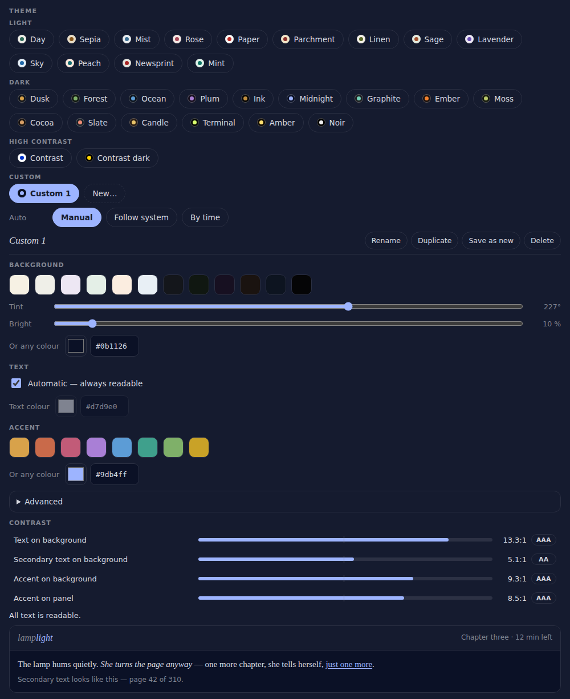
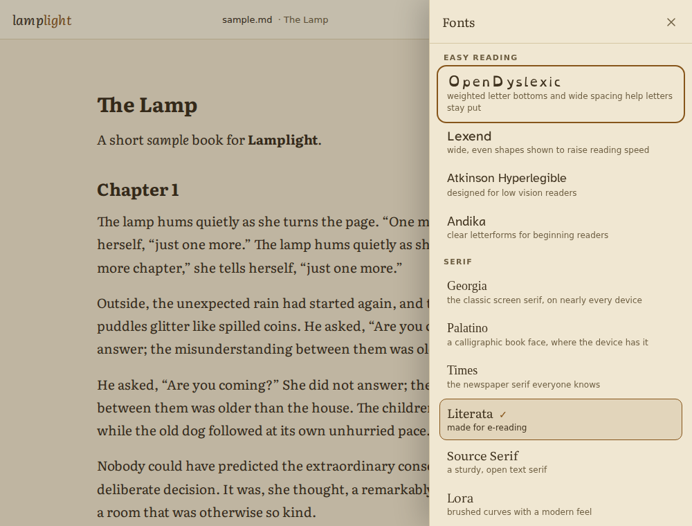
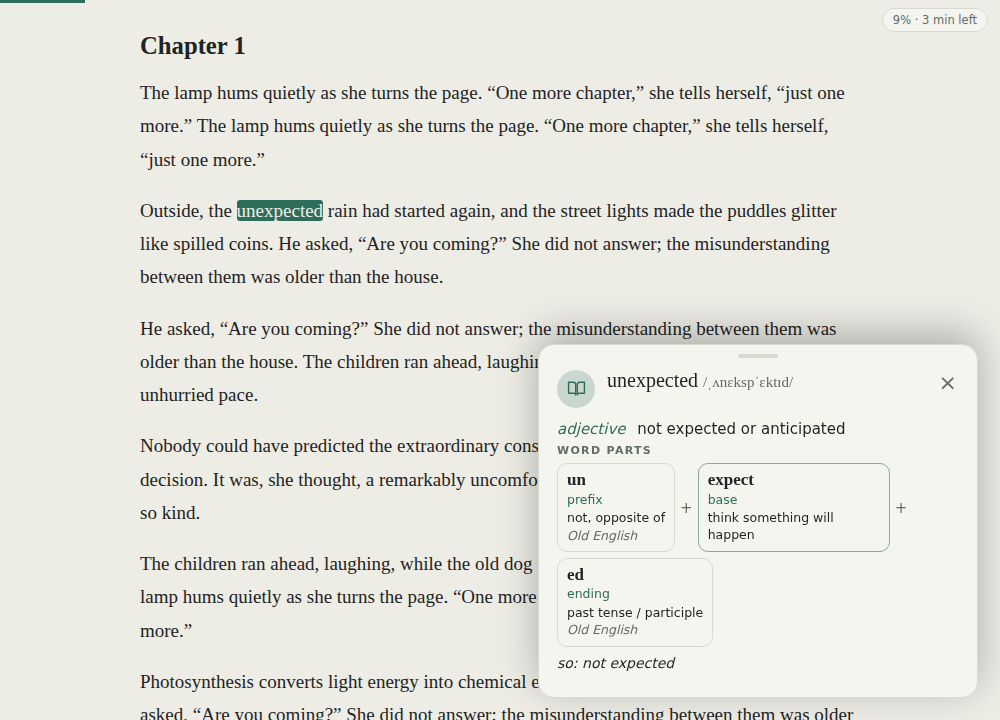
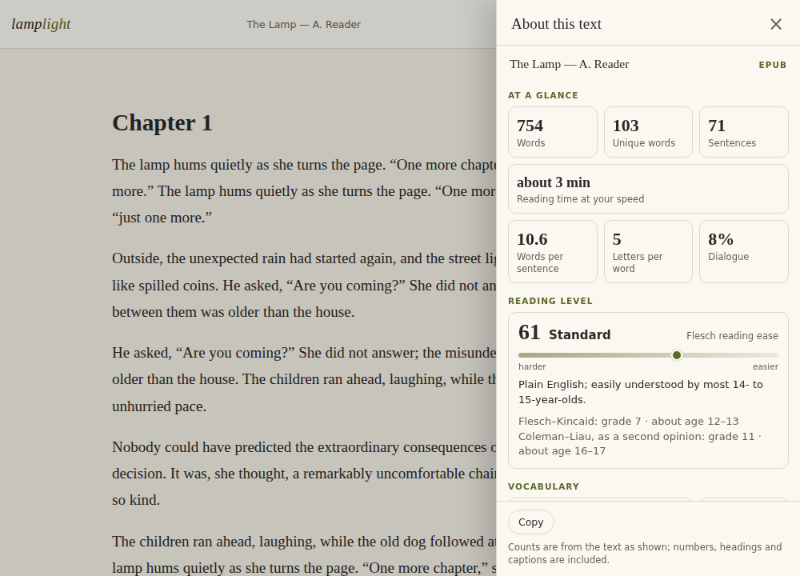
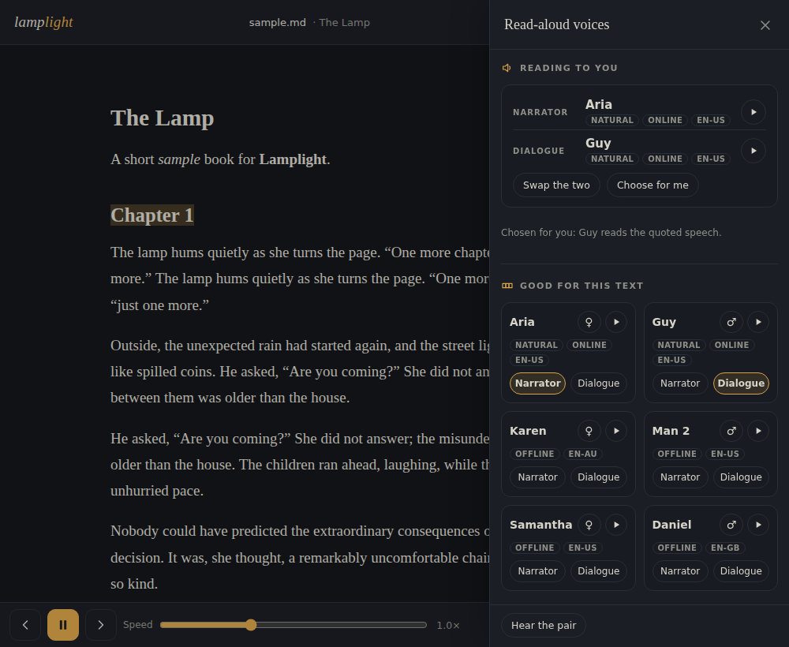
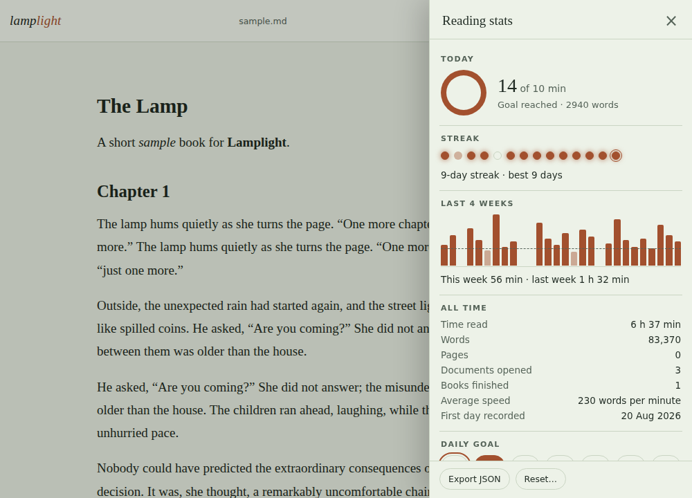
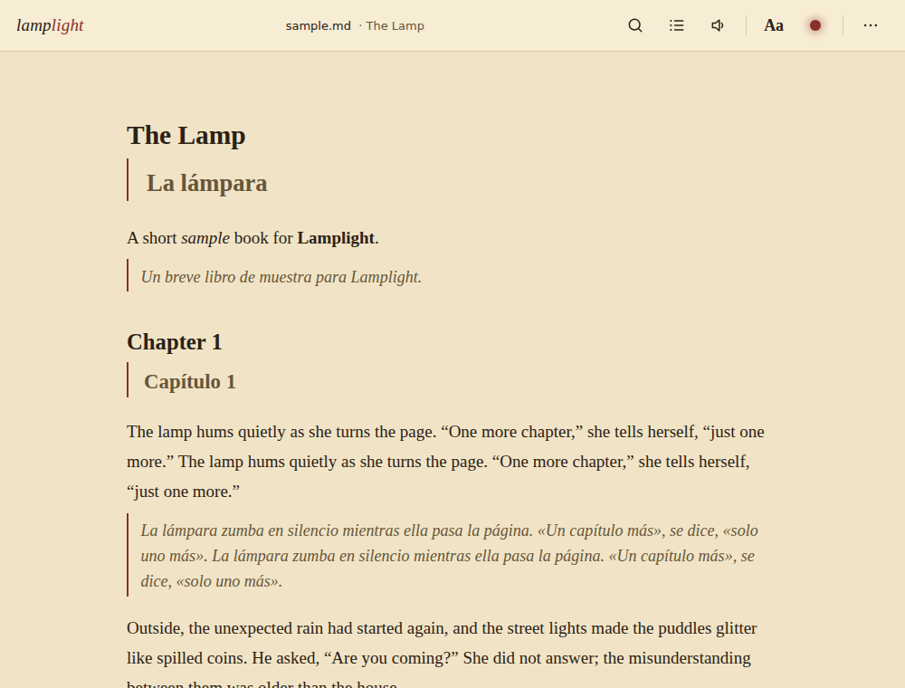
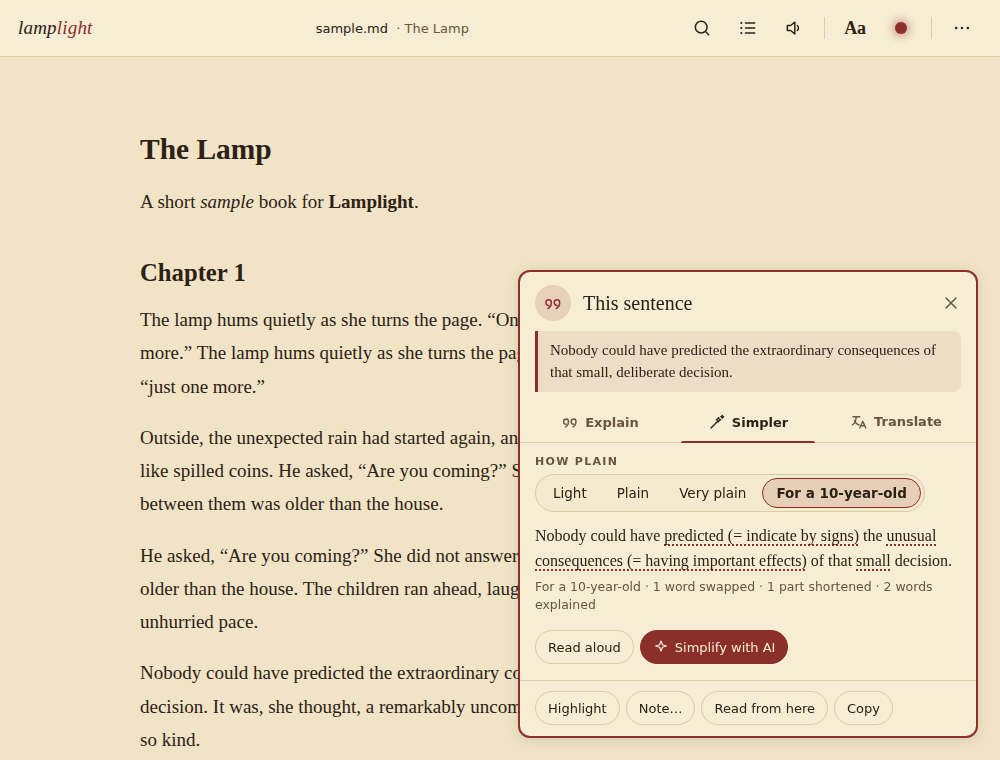
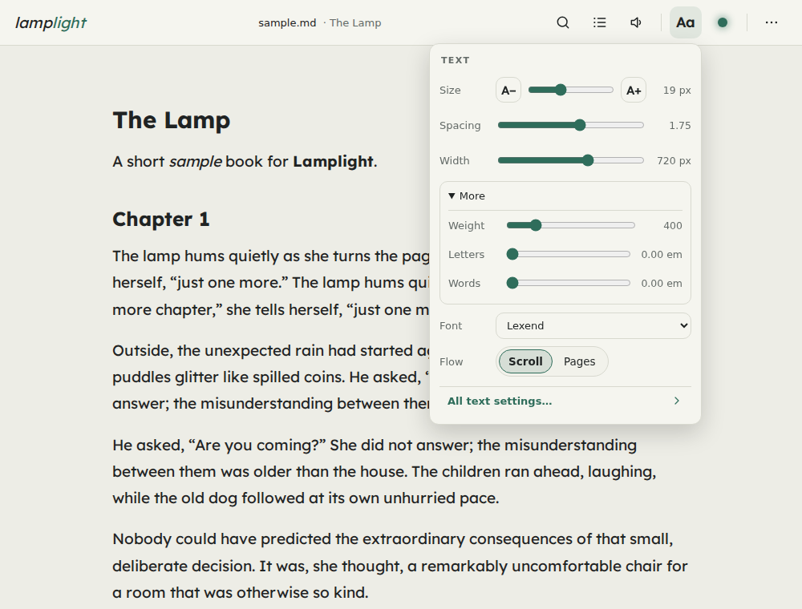
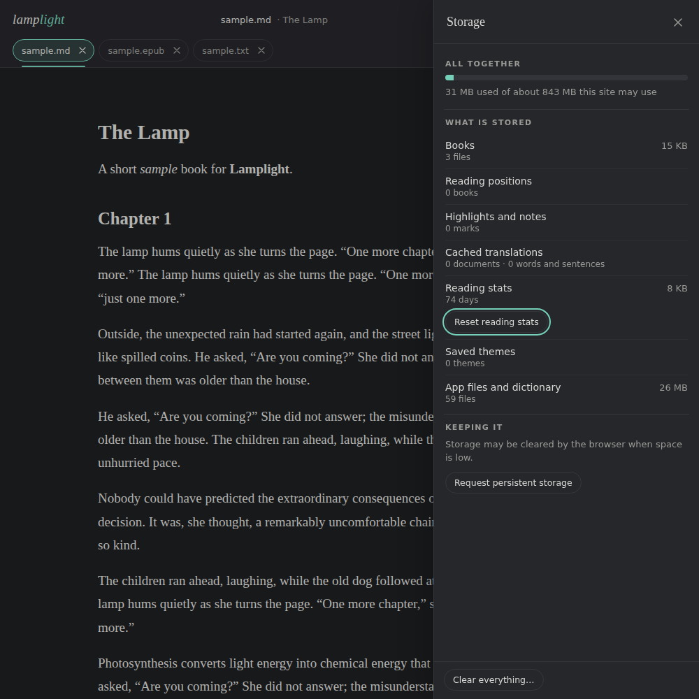

# Lamplight

**A quiet, offline-first reader for PDF, EPUB, DOCX, TXT, Markdown and HTML — with a built-in dictionary, word parts, a sentence explainer and simplifier, translation, and read-aloud with a voice for every character, all working without an internet connection.**

Lamplight is a progressive web app made of plain static files: no server, no accounts, no build step. Everything you open stays on your device.

**Live:** https://oofguy3.github.io/Lamplight/

<p align="center">
  
  &nbsp;&nbsp;
  
</p>
<p align="center">
  
  &nbsp;&nbsp;
  
</p>
<p align="center">
  
  &nbsp;&nbsp;
  
</p>
<p align="center">
  
  &nbsp;&nbsp;
  
</p>
<p align="center">
  
  &nbsp;&nbsp;
  
</p>
<p align="center">
  
  &nbsp;&nbsp;
  
</p>
<p align="center">
  
  &nbsp;&nbsp;
  
</p>

## Features

**Reading**
- A reader's shell that stays out of the way: a thin icon bar (search, contents, read aloud, **Aa** for type, the lamp for themes, the overflow menu), two popovers for the settings you change while reading, a tabbed settings sheet for the rest, one drawer for every panel, and a single dock at the foot holding the read-aloud bar and the pager. On a phone the popovers become bottom sheets.
- Opens **PDF, EPUB, DOCX, TXT, Markdown and HTML**. Saved web pages are reduced to clean reader text (menus, cookie banners, share bars and ads stripped).
- **Scroll** or **Pages** flow (tap the edges or swipe to turn); two pages side by side on wide screens, for PDFs too.
- **Thirty themes** in three groups — light (Day, Sepia, Paper, Parchment, Linen, Sage, Lavender, Sky, Peach, Newsprint, Mint…), dark (Dusk, Forest, Ocean, Plum, Midnight, Graphite, Ember, Moss, Cocoa, Slate, Candle, Terminal, Amber, Noir…) and two high-contrast ones — every one checked for 4.5:1 text contrast. **Auto theme** follows the system setting or a night schedule.
- A **custom theme editor**: colour pickers with hex fields for the background, text, accent and (under Advanced) the panel and secondary text, quick swatches and tint / brightness sliders, a **live contrast meter** that rates every pairing AAA / AA / Low and can fix a failing colour in one tap, and **as many saved custom themes as you like** (rename, duplicate, save as new, delete). The installed app's title bar follows the theme.
- **Twenty-four fonts** in four groups — easy reading (**OpenDyslexic**, **Lexend**, **Atkinson Hyperlegible**, **Andika**), serif (Georgia, Palatino, Times, Literata, Source Serif, Lora, Merriweather, EB Garamond, Crimson Pro, Libre Baskerville, Bitter), sans (system, Helvetica / Arial, Verdana, Inter, IBM Plex Sans, Nunito) and mono (system, JetBrains Mono, IBM Plex Mono). Sixteen families are bundled as compact woff2 files and **loaded only when chosen**; the *Browse fonts…* panel shows each name in its own face. Text size, line spacing, column width, margins, justification and hyphenation; every size is in `rem`, so the phone's font-size setting scales the whole app.
- **Weight, letter spacing, word spacing and paragraph gap**: a weight slider from 300 to 800 for the families that ship a variable file (the rest offer their two weights and say so), with headings and bold kept a step ahead of the text. One link restores every typographic default.
- **Warmth**: a warm film that layers over any theme for evening reading, with an option to bring it on during your night window and clear it by morning. Its ceiling is computed per theme, so text still clears 4.5:1 at full strength.
- PDF zoom, and "soften" for PDF pages in dark themes.
- **Zen mode** (`z`): only the text and the thin progress line, fullscreen where the browser allows it; Escape or `z` brings everything back.
- **Print**: a print stylesheet turns any text document into clean black-on-white pages (title line, link addresses, highlights kept as a grey wash); PDFs open in a new tab for the browser's own print.

**Understanding the text**
- **Tap a word** for its meaning from the built-in 170 000-entry dictionary (with an online fallback when a word is missing and you are online).
- **Word parts** under every definition: the word broken into **prefix, root and suffix** with the meaning and origin of each part and a plain "so: not able to be broken" reading — from tables of 111 prefixes, 97 suffixes and endings and 357 Latin, Greek and Old English roots (`morph.js`, loaded on demand). Tapping a base looks it up in turn.
- **Hold a sentence** (right-click on desktop, or select text) for an offline **Explain** card: the sentence split into clauses, who / did what / to whom, where and when, the tense with a one-line meaning, phrasal verbs and idioms found in the dictionary, and the sentence rewritten in plainer words. Key words are glossed underneath.
- **About this text** (`i`): word, unique-word and sentence counts, reading time at your own speed, **reading level** (Flesch reading ease with a plain-English band, Flesch–Kincaid grade and age, Coleman–Liau as a second opinion), vocabulary richness, dialogue share, and the **thirty hardest words** in the document — tap one for its definition or find it in the text. Works for PDFs too.
- **Simplify** any selected sentence or passage (the pill's *Simplify* button, or from the Explain card): an offline, rule-based rewrite that swaps rarer words for common ones, replaces idioms and wordy phrases, splits over-long sentences and turns clear passives into actives, with every change underlined and explained ("was 'extraordinary' — rarer word") so nothing is hidden; copy it or hear it read aloud.
  **Four strengths**: *light* swaps only genuinely rare words; *plain* is the default; *very plain* also splits long sentences, breaks semicolons and dashes into full stops and rewrites stiff connectors; *for a ten-year-old* adds all of that plus cutting trailing clauses loose, reducing stacked adjectives, writing out abbreviations, saying large numbers in words and glossing any word still likely to be unfamiliar.
- **Figures of speech and register** in the Explain card: similes, metaphors, personification, hyperbole and idioms are named and quoted — touch one and the exact words light up in the sentence — and the sentence's register (archaic, spoken, formal, literary or neutral) is given with the evidence for it.
- **Translate** a tapped word, a selected sentence, or the **whole document** into any of 36 languages. Two engines, used in this order: the browser's **built-in on-device translator** (Chrome and Edge; private, free, and offline once its language pack is downloaded), or the free **MyMemory** web service for single words and sentences. A translated document shows each paragraph's translation beneath it without touching the original text, so highlights, search, positions and read aloud keep working; translations are cached on the device, so a translated book reopens translated, even offline.

**Keeping your place**
- **Library**: every file you open is kept on the device with its progress; reopen and you are exactly where you left off — across font, width and flow changes. **Pin** the books you are reading to keep them at the top in an order you set, and the Continue card follows the pin.
- A **finish forecast** on every book, as time left and as roughly how many more evenings at your usual reading rhythm.
- A **Storage panel** showing exactly what Lamplight keeps on this device — books, positions, highlights, cached translations, stats, saved themes, the app files and dictionary — against your browser's quota, with each row clearable on its own.
- **Highlights, bookmarks and notes**, exportable as Markdown, JSON or **Obsidian** Markdown (front matter, a legend callout and a heading per chapter). Type `#tags` in a note and they become filter chips; name the four highlight colours once and the names appear everywhere you pick one; search across every highlight, note and bookmark.
- **Tabs** for several open documents (Ctrl/⌘+Tab switches; × closes).
- **Contents** panel: PDF outline, EPUB navigation or document headings. **Search** inside the document, PDFs included.
- **Reading stats and streaks** (`g`): minutes, words and pages per day, a daily goal you choose, the current and longest **streak** of days you kept it, four weeks of bars, a **twelve-week speed trend** with a plain reading of it, **yearly book and page goals** alongside the daily one, a per-book section with time read and its forecast, and all-time totals. The start screen shows your streak; everything can be exported as JSON or reset.
- A **reading-pace detector** behind all of it. Scrolling quickly to check something, hopping between search hits, page-flipping, auto-scroll, read aloud, a lookup card left open and simply walking away are all told apart from reading, and only genuine reading is timed. Words skimmed past are counted separately from words read. The pace is kept per book as well as overall, with a confidence that says how much reading it rests on, and it drives the time-left readout, the forecasts and auto-scroll's speed.

**Reading aids**
- **Read aloud** (Web Speech API) sentence by sentence, with a picker that leads on a handful of good choices rather than a hundred: a **recommended pair** of narrator and dialogue voice with a preview on each, six cards for the best women's and men's voices in the document's language, and the full list folded away behind one tap. Gender is read from the voice's identifier as well as its name, so the men's voices on Android and the Microsoft Natural set are recognised; where a device says nothing, a chip on each card lets you mark it and Lamplight remembers. Voices you never want can be hidden. Your choices are kept **per language**, so an English book and a Spanish one keep their own. There is a **separate voice for dialogue** (by default the other voice, so quoted speech is easy to tell from narration) and **expression read off the text**: questions lift, exclamations quicken, ellipses and paragraph ends pause, headings slow down, and "whispered" / "shouted" / "sighed" around a quote change how it is spoken. Off, Natural or Dramatic. The document's language is detected and used for the voice and for hyphenation, and playback eases in over the first three sentences. **Lock-screen and headphone controls** (play, pause, previous and next sentence) through the Media Session API, and a **sleep timer** that stops at the end of the sentence after 15 to 60 minutes or at the end of the chapter.
- **A voice per character**: read aloud gives every speaking character their own device voice (turn off in settings). Who speaks each line is worked out on the device from the quoted lines and the speech tags around them (*said Anna*, *he whispered*, turn-taking); *Voices for characters…* shows who was found and lets you change each voice and its pitch. Lines no one is named for keep the dialogue voice.
- **Read aloud with ElevenLabs voices** (optional): paste your own ElevenLabs API key and the book is narrated by a narrator voice plus a different voice for each speaking character, worked out offline from the text. Audio is generated as you listen and kept on the device, so replays are free. Limitations: speaker attribution understands English speech tags; dialogue introduced with an em-dash is read by the narrator.
- **Natural voices** (optional, free): a one-time download (≈ 95 MB, from huggingface.co) puts the Kokoro-82M speech model on the device, and from then on the book is read **offline** by natural-sounding voices — a narrator of your choice among 28 American and British voices, and a **different voice for each speaking character**, cast the same way as with ElevenLabs. Speech is made as you listen, a few sentences ahead, and kept on the device (up to 400 MB across all books, oldest first), so replays are instant. Limitations: the voices speak **English** (other languages sound odd); making speech is heavy work for an old phone, where a sentence can take longer to make than it lasts; the model takes 95 MB of storage and a few seconds to load each time reading starts.
- Reading **ruler**, **auto-scroll** at your pace (timed page turns in Pages flow), and a progress readout with **time left** from your measured reading speed.
- Screen wake lock while reading; keyboard shortcuts (`?` shows them all); works with reduced-motion and forced-colour settings.

**As an app**
- Installs as a PWA, works fully offline (a versioned service worker precaches everything — fonts and word-part tables included — and offers a one-tap reload when a new version is ready).
- "Open with" from the file manager, share files or text to Lamplight from other apps, app shortcuts (Continue reading, Library).

## Install / use

You can use Lamplight in the browser at the live link, or install it:

- **Android / Chrome:** open the link → menu ⋮ → *Install app* (or *Add to Home screen*).
- **iPhone / iPad:** open the link in Safari → Share → *Add to Home Screen*.
- **Desktop (Chrome, Edge):** click the install icon in the address bar.

After the first visit everything is cached; the app, the dictionary, the fonts and the read-aloud voices your device provides work with no connection at all.

### Self-hosting

Lamplight is plain static files. Copy the repository to any static host (GitHub Pages, Netlify, a folder on a web server) — it must be served over **HTTPS** (or `localhost`) for the service worker and installation to work. There is nothing to build:

```
index.html              the shell
app.js  app.css         the reader
explain.js              the offline sentence explainer
morph.js                word parts: prefixes, roots and suffixes with meanings
translate.js            translation engines, the bilingual page view and its cache
audiobook.js            who speaks each line, a voice per character, ElevenLabs and natural (Kokoro) narration (loaded on demand)
sw.js                   service worker (bump VERSION on every release)
manifest.webmanifest    PWA manifest
dict1–6.json, dict-index.json   the offline dictionary (alphabetical chunks + index)
vendor/                 pdf.js, mammoth, marked, DOMPurify, JSZip
vendor/kokoro/          kokoro-js and ONNX Runtime for the natural voices (the model itself is downloaded from huggingface.co on demand)
workers/                the DOCX worker and the natural-voices worker
fonts/                  the bundled reading fonts (Latin woff2 subsets) and their licences
tests/                  browser tests (not needed to run the app)
```

Opening `index.html` straight from a folder (`file://`) works for reading, but browsers block `fetch()` on `file://` URLs, so the offline dictionary, the bundled fonts (and the service worker) are only available when the folder is served over HTTP(S).

### Read aloud with ElevenLabs (optional)

Start reading aloud (`r`, or *Read aloud* in the menu), press the voice button in the bar to open *Read-aloud voices*, and under *Voices from* choose *ElevenLabs*; then *ElevenLabs API key…* and paste a key from your ElevenLabs account. Pick a narrator voice and a model; *Voices for characters…* shows who was found speaking in the open book and lets you change each voice. The key is stored only in your browser's local storage and is sent only to `api.elevenlabs.io` while reading aloud with that engine; every clip is kept in IndexedDB, so a sentence is only ever paid for once. The bar shows roughly how many characters have been sent.

### Natural voices (optional)

Under *Voices from* choose *Natural voices*, then *Download natural voices* (≈ 95 MB, once; a progress bar shows the download — starting to read aloud with the engine downloads it too when you are online, and reads with the device voice when you are not). Pick a narrator; *Voices for characters…* shows who was found speaking in the open book and lets you change each voice. Speech is made on the device by [Kokoro-82M](https://huggingface.co/hexgrad/Kokoro-82M) through kokoro-js and ONNX Runtime in a Web Worker, so nothing is sent anywhere and it works offline once the model (and each voice used, half a megabyte apiece) is on the device; the bar shows *Preparing…* while the model loads and *Generating…* while a sentence is being made. Every clip is kept in IndexedDB — up to 400 MB across all books; *Audio kept on this device* in the voices panel shows how much, with a *Clear* — and *Remove* takes the model off the device again. The service worker adds cross-origin isolation headers to the page so the model can use several threads where the browser allows it.

## Keyboard shortcuts

`o` open · `s` settings · `t` next theme · `+` / `−` text size or zoom · `p` scroll / pages · `/` or Ctrl+F search · `c` contents · `b` bookmark here · `n` bookmarks & notes · `r` read aloud · `l` reading ruler · `a` auto-scroll · `z` zen mode · `i` about this text · `g` reading stats · `h` library · `?` this list · arrows / PgUp / PgDn / Space turn pages, Home / End first / last page · Esc closes anything.

## Privacy

Files, positions, highlights, notes, cached translations, cached read-aloud audio and the voices cast for each book's characters live in your browser's IndexedDB; settings, saved themes and reading stats (and, if you use those engines, your ElevenLabs key, narrator, model and voice list, and the natural voices' narrator) in local storage. Nothing is uploaded anywhere unless you turn on the ElevenLabs read-aloud engine, which sends the sentences being read (and your key) to `api.elevenlabs.io` and nothing else. The natural voices are downloaded once from `huggingface.co` (the Kokoro model and a voice file for each voice used, about 95 MB in all, kept in the browser's Cache Storage) and then run entirely on the device: no text or audio leaves it. Apart from that, the only network requests the app makes are for its own files (cached after the first visit), the free `api.dictionaryapi.dev` lookup when a word is not in the offline dictionary and you are online, and — only when you press the button — MyMemory (`api.mymemory.translated.net`, which receives the word or sentence you translate). The built-in translator runs on your device, and so does working out who speaks each line. Read aloud with the device voice uses the speech voices installed on your device; some browsers list "online" voices that the browser itself fetches.

## Development

Everything is hand-written ES5-style JavaScript in `app.js` (with `explain.js`, `morph.js`, `translate.js` and `audiobook.js` loaded on demand); there is no bundler and no dependencies to install. To work on it, serve the folder over HTTPS or `localhost` (for example `python3 -m http.server`) and open it in a browser.

Releasing: bump `VERSION` in `sw.js` — every file, `index.html` included, is served from that version's cache, so the shell and its scripts always match; installed copies pick the new version up in the background and show a *Reload* toast. Without the bump, a deployed change is not picked up by installed copies. The natural voices' runtime (`vendor/kokoro/`, 24 MB) is not precached: it is cached the first time that engine runs, and the model caches (`transformers-cache`, `kokoro-voices`) survive releases. The deploy workflow also runs Lighthouse against the published site and requires an accessibility score of at least 0.9.

### Tests

`tests/` holds browser tests that drive the real app in headless Chromium through [Playwright](https://playwright.dev) (the only development dependency; install it globally with `npm i -g playwright` and `npx playwright install chromium`, or point `PLAYWRIGHT_BROWSERS_PATH` at an existing install):

```
python3 tests/make-fixtures.py        # builds sample.txt/.md/.html/.epub/.docx/.pdf in tests/fixtures
NODE_PATH=$(npm root -g) node tests/all.js          # every suite in turn, with one summary table
NODE_PATH=$(npm root -g) node tests/all.js '^ui-'   # or a subset, by pattern
NODE_PATH=$(npm root -g) node tests/smoke.js        # every format, both flows, a dictionary tap
NODE_PATH=$(npm root -g) node tests/regression.js   # library, tabs, marks, search, contents, explain, PDF, offline, update toast, install
NODE_PATH=$(npm root -g) node tests/themes.js       # contrast audit of every built-in theme (node only)
NODE_PATH=$(npm root -g) node tests/wordparts.js    # 300 word decompositions (node only)
```

plus `themes-browser.js`, `fonts.js`, `type2.js`, `speak.js` (with a stubbed speech engine and media session), `wordparts-browser.js`, `about.js`, `stats.js` and `stats2.js` (with Playwright's fake clock), `library2.js`, `notes2.js`, `zen.js`, `print.js` (print media emulation), `translate.js` (stubbed translator and MyMemory routes), `simplify.js`, `explain2.js`, `pace.js` (a simulated reader driven against a fake clock) and `ui-a/b/c.js` for the interface itself. Each script starts its own server on a free port and exits non-zero on failure.

`tests/screenshots.js` remakes the pictures at the top of this file from the running app, so they never drift from it (`node tests/screenshots.js` for all of them, or name the ones you want).

The reading-pace detector in `app.js` turns the visible text window into a stream of samples, coalesces them into gestures, classifies each transition (still, step, skim, pause, back, jump, navigation) and collects the ones that are reading into runs; the estimate is a weighted median over recent runs with a prior that fades as real reading arrives. Anything that is not reading — a panel or card over the text, read aloud, auto-scroll, a hidden tab, a search or contents jump — is subtracted as a blocked interval rather than guessed at. `window.llPace` exposes its state for the tests.

The `explain.js` analyser is rule-based: a tokeniser that splits contractions, a part-of-speech tagger that combines the dictionary with built-in word lists, clause splitting on conjunctions, subordinators and relative pronouns, and a small grammar for verb groups (tense, aspect, modals, passives, questions and imperatives). It runs in well under a millisecond per sentence. `morph.js` works the same way: tables of affixes and bound roots, spelling repairs (a dropped *e*, a doubled consonant, *y* to *i*), and a scorer that prefers readings whose parts are all known and leaves common words alone.

## Credits

Lamplight bundles these open-source projects; each keeps its own licence (in `vendor/` and `fonts/`):

- [pdf.js](https://mozilla.github.io/pdf.js/) 3.11.174 — Mozilla, Apache-2.0 — renders PDFs.
- [mammoth.js](https://github.com/mwilliamson/mammoth.js) 1.6.0 — Michael Williamson, BSD-2-Clause — converts DOCX to HTML.
- [marked](https://marked.js.org/) 9.1.6 — MIT — renders Markdown.
- [DOMPurify](https://github.com/cure53/DOMPurify) 3.0.8 — Cure53, Apache-2.0 / MPL-2.0 — sanitises every document before it is shown.
- [JSZip](https://stuk.github.io/jszip/) 3.10.1 — Stuart Knightley, MIT — unpacks EPUB files.
- Fonts, all under the SIL Open Font License 1.1, each with its copyright holders, reserved font name and upstream project listed in `fonts/LICENSES.md`: [Atkinson Hyperlegible](https://brailleinstitute.org/freefont) (Braille Institute of America), [OpenDyslexic](https://opendyslexic.org/) (Abbie Gonzalez), [Lexend](https://github.com/googlefonts/lexend), [Andika](https://software.sil.org/andika/) (SIL International), [Literata](https://github.com/googlefonts/literata), [Source Serif](https://github.com/adobe-fonts/source-serif) (Adobe), [Lora](https://github.com/cyrealtype/Lora-Cyrillic), [Merriweather](https://github.com/EbenSorkin/Merriweather4), [EB Garamond](https://github.com/octaviopardo/EBGaramond12), [Crimson Pro](https://github.com/Fonthausen/CrimsonPro), [Libre Baskerville](https://github.com/impallari/Libre-Baskerville), [Bitter](https://github.com/solmatas/BitterPro), [Inter](https://github.com/rsms/inter), [IBM Plex Sans and Mono](https://github.com/IBM/plex) (IBM), [Nunito](https://github.com/googlefonts/nunito) and [JetBrains Mono](https://github.com/JetBrains/JetBrainsMono) (JetBrains). The Latin woff2 subsets are the ones published by [Fontsource](https://fontsource.org/).
- The offline dictionary (`dict1–6.json`) combines public-domain definitions from *Webster's Revised Unabridged Dictionary* (1913) with WordNet-style glosses, synonyms and IPA pronunciations. [WordNet](https://wordnet.princeton.edu/) is © Princeton University, used under the WordNet License.
- The word-frequency list inside `explain.js` (used to decide which words need glossing, and by *About this text* to find the hardest words) is derived from [google-10000-english](https://github.com/first20hours/google-10000-english), MIT.
- The affix and root tables in `morph.js` were written for Lamplight from the classic school lists of Latin and Greek word roots.
- The optional online word lookup uses the [Free Dictionary API](https://dictionaryapi.dev/).
- The optional multi-voice narration uses the [ElevenLabs](https://elevenlabs.io/) text-to-speech API with your own key.
- The natural voices are [Kokoro-82M](https://huggingface.co/hexgrad/Kokoro-82M) by hexgrad, Apache-2.0 (the ONNX build [onnx-community/Kokoro-82M-v1.0-ONNX](https://huggingface.co/onnx-community/Kokoro-82M-v1.0-ONNX), downloaded on demand), run on the device by [kokoro-js](https://github.com/hexgrad/kokoro) 1.2.1 (Apache-2.0, bundling [Transformers.js](https://github.com/huggingface/transformers.js)) and [ONNX Runtime](https://onnxruntime.ai/) Web 1.22 (Microsoft, MIT); see `vendor/LICENSES.md`.

Lamplight itself is released under the [MIT License](LICENSE).
