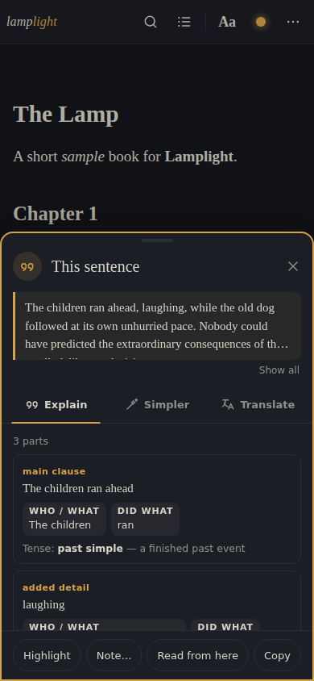
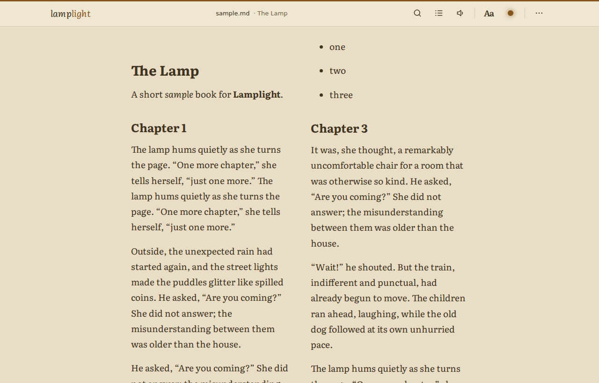
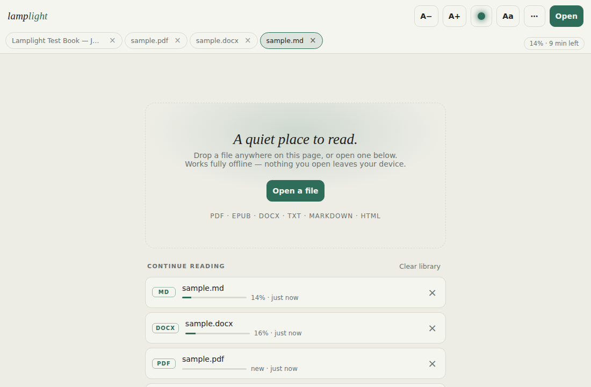
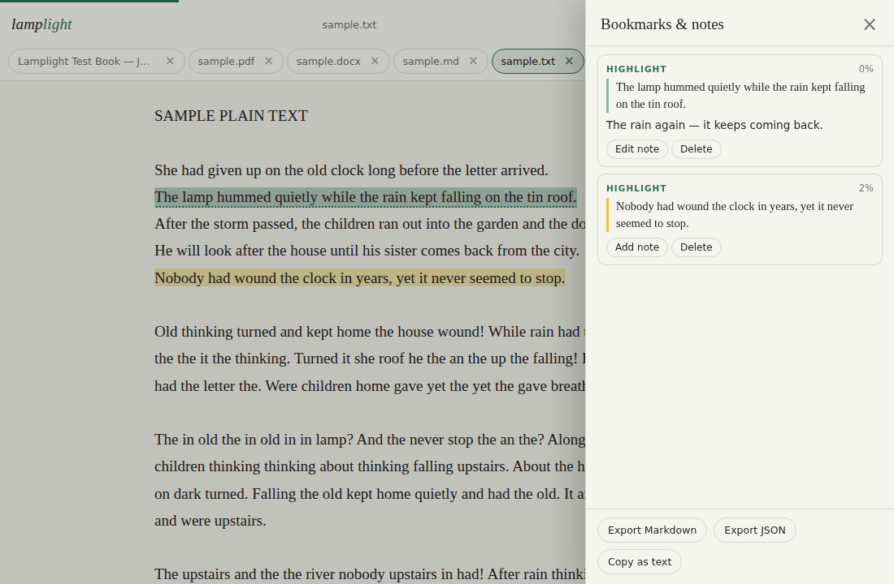

# Lamplight

**A quiet, offline-first reader for PDF, EPUB, DOCX, TXT, Markdown and HTML — with a built-in dictionary and a sentence explainer that work without an internet connection.**

Lamplight is a progressive web app made of plain static files: no server, no accounts, no build step. Everything you open stays on your device.

**Live:** https://oofguy3.github.io/Lamplight/

<p align="center">
  
  &nbsp;&nbsp;
  
</p>
<p align="center">
  
  &nbsp;&nbsp;
  
</p>

## Features

**Reading**
- Opens **PDF, EPUB, DOCX, TXT, Markdown and HTML**. Saved web pages are reduced to clean reader text (menus, cookie banners, share bars and ads stripped).
- **Scroll** or **Pages** flow (tap the edges or swipe to turn); two pages side by side on wide screens, for PDFs too.
- Nine themes plus two high-contrast ones and a fully custom theme (background tint, brightness, text and accent colour). **Auto theme** follows the system setting or a night schedule.
- Typography: serif, sans, mono or **Atkinson Hyperlegible**; text size, line spacing, column width, margins, justification and hyphenation. Every size is in `rem`, so the phone's font-size setting scales the whole app.
- PDF zoom, and "soften" for PDF pages in dark themes.

**Understanding the text**
- **Tap a word** for its meaning from the built-in 170 000-entry dictionary (with an online fallback when a word is missing and you are online).
- **Hold a sentence** (right-click on desktop, or select text) for an offline **Explain** card: the sentence split into clauses, who / did what / to whom, where and when, the tense with a one-line meaning, phrasal verbs and idioms found in the dictionary, and the sentence rewritten in plainer words. Key words are glossed underneath.
- Optional **Explain with AI** button (shown only when online) using an Anthropic API key you paste into settings; the key stays in local storage.

**Keeping your place**
- **Library**: every file you open is kept on the device with its progress; reopen and you are exactly where you left off — across font, width and flow changes.
- **Highlights, bookmarks and notes**, exportable as Markdown or JSON.
- **Tabs** for several open documents (Ctrl/⌘+Tab switches; × closes).
- **Contents** panel: PDF outline, EPUB navigation or document headings. **Search** inside the document, PDFs included.

**Reading aids**
- **Read aloud** (Web Speech API) sentence by sentence with speed and voice controls.
- Reading **ruler**, **auto-scroll** at your pace (timed page turns in Pages flow), and a progress readout with **time left** from your measured reading speed.
- Screen wake lock while reading; keyboard shortcuts (`?` shows them all); works with reduced-motion and forced-colour settings.

**As an app**
- Installs as a PWA, works fully offline (a versioned service worker precaches everything and offers a one-tap reload when a new version is ready).
- "Open with" from the file manager, share files or text to Lamplight from other apps, app shortcuts (Continue reading, Library).

## Install / use

You can use Lamplight in the browser at the live link, or install it:

- **Android / Chrome:** open the link → menu ⋮ → *Install app* (or *Add to Home screen*).
- **iPhone / iPad:** open the link in Safari → Share → *Add to Home Screen*.
- **Desktop (Chrome, Edge):** click the install icon in the address bar.

After the first visit everything is cached; the app and the dictionary work with no connection at all.

### Self-hosting

Lamplight is plain static files. Copy the repository to any static host (GitHub Pages, Netlify, a folder on a web server) — it must be served over **HTTPS** (or `localhost`) for the service worker and installation to work. There is nothing to build:

```
index.html              the shell
app.js  app.css         the reader
explain.js              the offline sentence explainer
sw.js                   service worker (bump VERSION on every release)
manifest.webmanifest    PWA manifest
dict1–6.json, dict-index.json   the offline dictionary (alphabetical chunks + index)
vendor/                 pdf.js, mammoth, marked, DOMPurify, JSZip
workers/                the DOCX worker
fonts/                  Atkinson Hyperlegible
```

Opening `index.html` straight from a folder (`file://`) also works for reading; only the offline install is unavailable there.

### Explain with AI (optional)

Settings → Dictionary → *Anthropic API key…* Paste a key from https://console.anthropic.com. It is stored only in your browser's local storage and sent only to `api.anthropic.com` when you press *Explain with AI*. Nothing else in the app talks to the network.

## Keyboard shortcuts

`o` open · `s` settings · `t` next theme · `+` / `−` text size or zoom · `p` scroll / pages · `/` or Ctrl+F search · `c` contents · `b` bookmark here · `n` bookmarks & notes · `r` read aloud · `l` reading ruler · `a` auto-scroll · `h` library · `?` this list · arrows / PgUp / PgDn / Space turn pages, Home / End first / last page · Esc closes anything.

## Privacy

Files, positions, highlights and notes live in your browser's IndexedDB; settings in local storage. Nothing is uploaded anywhere. The only network requests the app makes are for its own files (cached after the first visit), the free `api.dictionaryapi.dev` lookup when a word is not in the offline dictionary and you are online, and — only if you set a key and press the button — the Anthropic API.

## Development

Everything is hand-written ES5-style JavaScript in `app.js`; there is no bundler and no dependencies to install. To work on it, serve the folder over HTTPS or `localhost` (for example `python3 -m http.server`) and open it in a browser.

Releasing: bump `VERSION` in `sw.js` — every file, `index.html` included, is served from that version's cache, so the shell and its scripts always match; installed copies pick the new version up in the background and show a *Reload* toast. Without the bump, a deployed change is not picked up by installed copies.

The `explain.js` analyser is rule-based: a tokeniser that splits contractions, a part-of-speech tagger that combines the dictionary with built-in word lists, clause splitting on conjunctions, subordinators and relative pronouns, and a small grammar for verb groups (tense, aspect, modals, passives, questions and imperatives). It runs in well under a millisecond per sentence.

## Credits

Lamplight bundles these open-source projects; each keeps its own licence (in `vendor/` and `fonts/`):

- [pdf.js](https://mozilla.github.io/pdf.js/) 3.11.174 — Mozilla, Apache-2.0 — renders PDFs.
- [mammoth.js](https://github.com/mwilliamson/mammoth.js) 1.6.0 — Michael Williamson, BSD-2-Clause — converts DOCX to HTML.
- [marked](https://marked.js.org/) 9.1.6 — MIT — renders Markdown.
- [DOMPurify](https://github.com/cure53/DOMPurify) 3.0.8 — Cure53, Apache-2.0 / MPL-2.0 — sanitises every document before it is shown.
- [JSZip](https://stuk.github.io/jszip/) 3.10.1 — Stuart Knightley, MIT — unpacks EPUB files.
- [Atkinson Hyperlegible](https://brailleinstitute.org/freefont) — Braille Institute of America, SIL Open Font License 1.1.
- The offline dictionary (`dict1–6.json`) combines public-domain definitions from *Webster's Revised Unabridged Dictionary* (1913) with WordNet-style glosses, synonyms and IPA pronunciations. [WordNet](https://wordnet.princeton.edu/) is © Princeton University, used under the WordNet License.
- The word-frequency list inside `explain.js` (used to decide which words need glossing) is derived from [google-10000-english](https://github.com/first20hours/google-10000-english), MIT.
- The optional online word lookup uses the [Free Dictionary API](https://dictionaryapi.dev/).

Lamplight itself is released under the [MIT License](LICENSE).
