# Lamplight

**A quiet, offline-first reader for PDF, EPUB, DOCX, TXT, Markdown and HTML — with a built-in dictionary, word parts, a sentence explainer and simplifier, translation, and read-aloud with a voice for every character, all working without an internet connection.**

Lamplight is a progressive web app made of plain static files: no server, no accounts, no build step. Everything you open stays on your device.

**Live:** https://oofguy3.github.io/Lamplight/

<p align="center">
  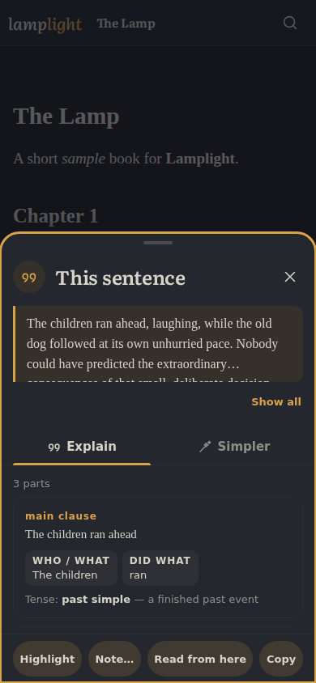
  &nbsp;&nbsp;
  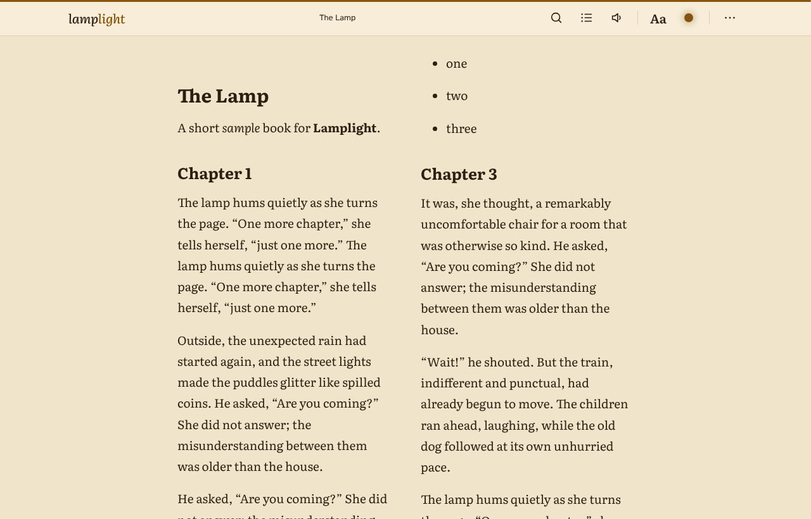
</p>
<p align="center">
  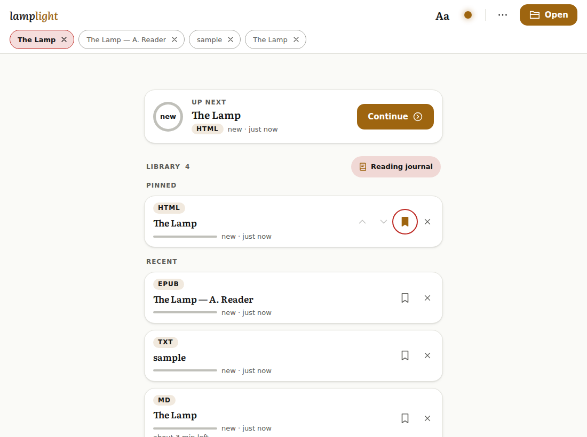
  &nbsp;&nbsp;
  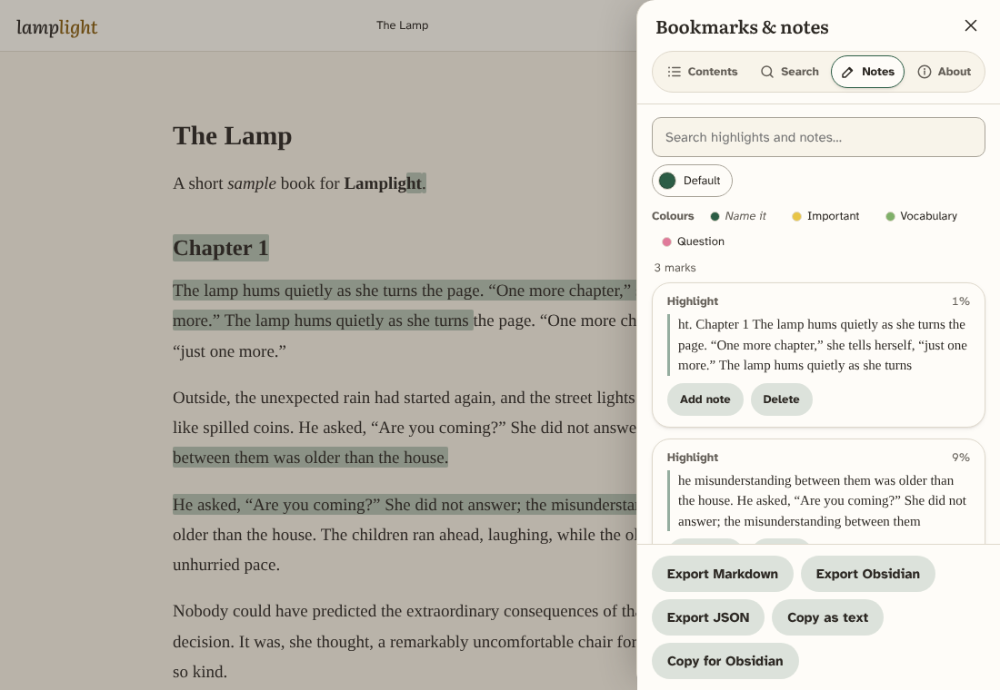
</p>
<p align="center">
  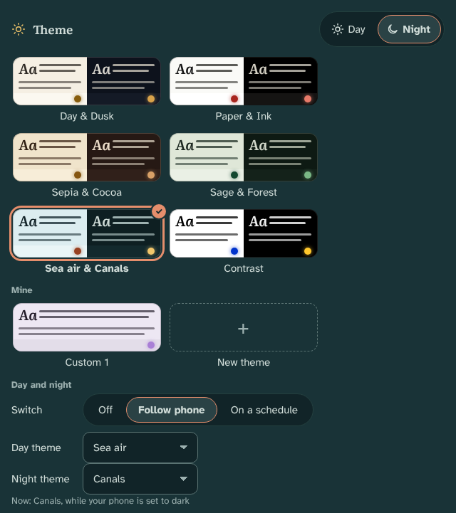
  &nbsp;&nbsp;
  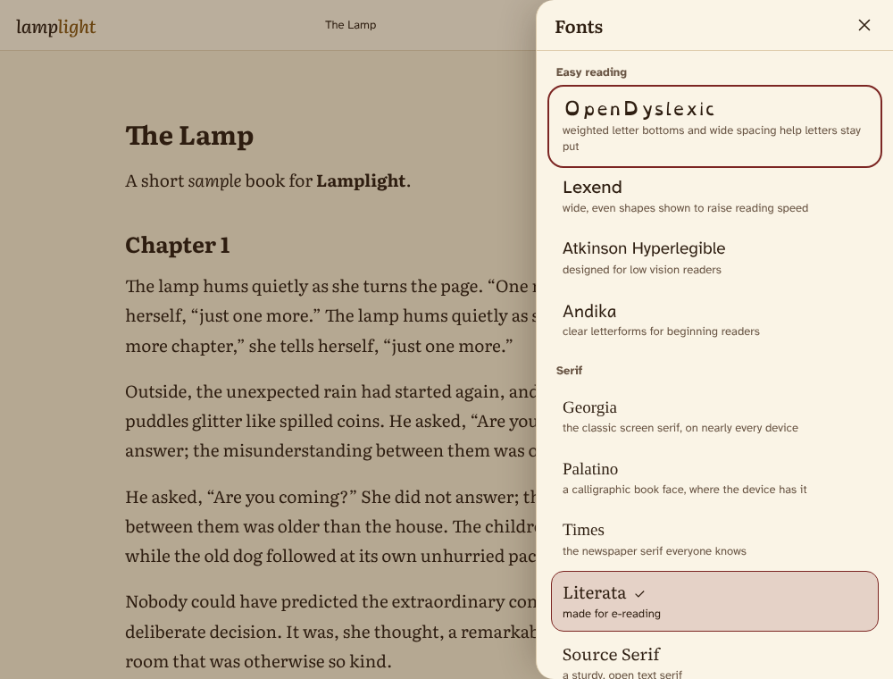
</p>
<p align="center">
  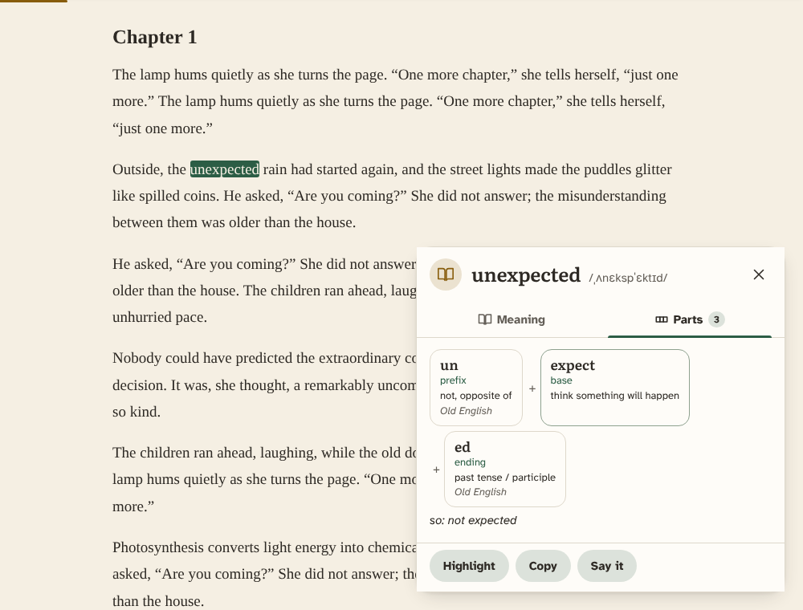
  &nbsp;&nbsp;
  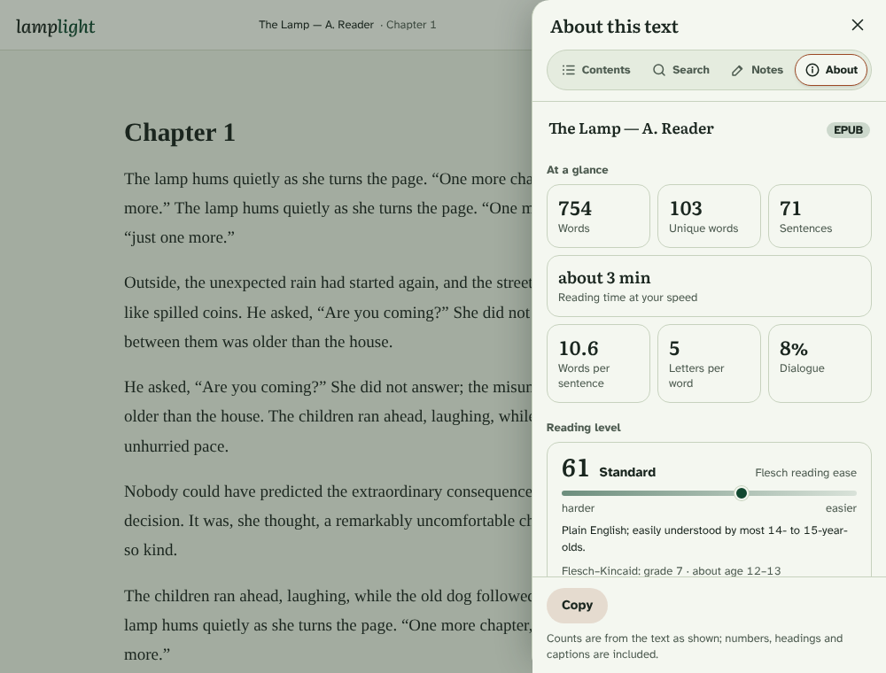
</p>
<p align="center">
  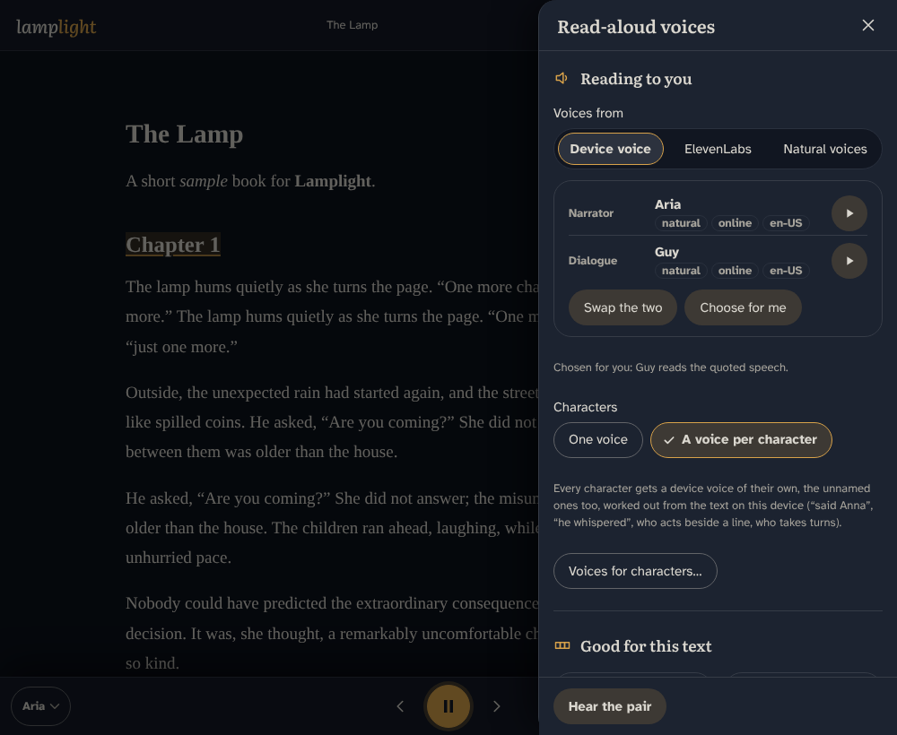
  &nbsp;&nbsp;
  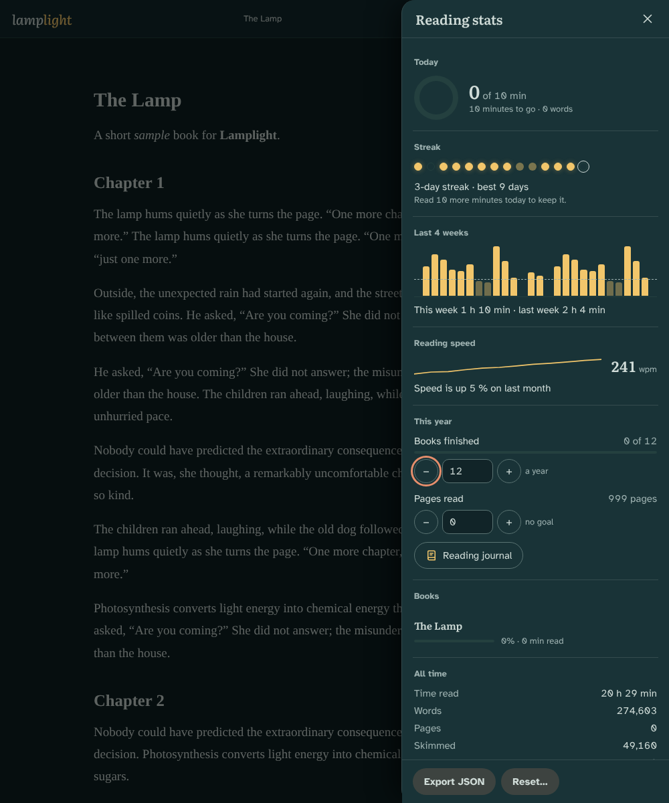
</p>
<p align="center">
  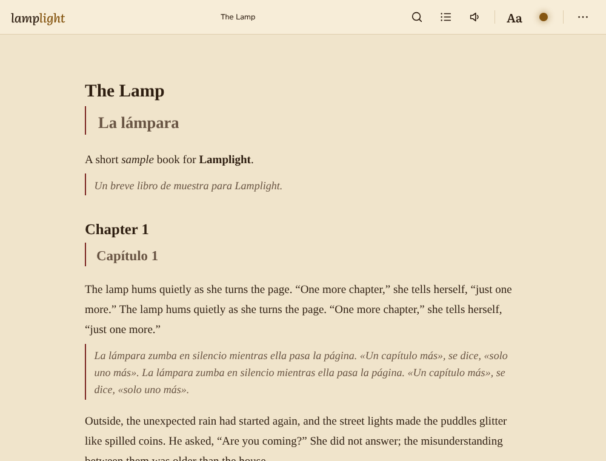
  &nbsp;&nbsp;
  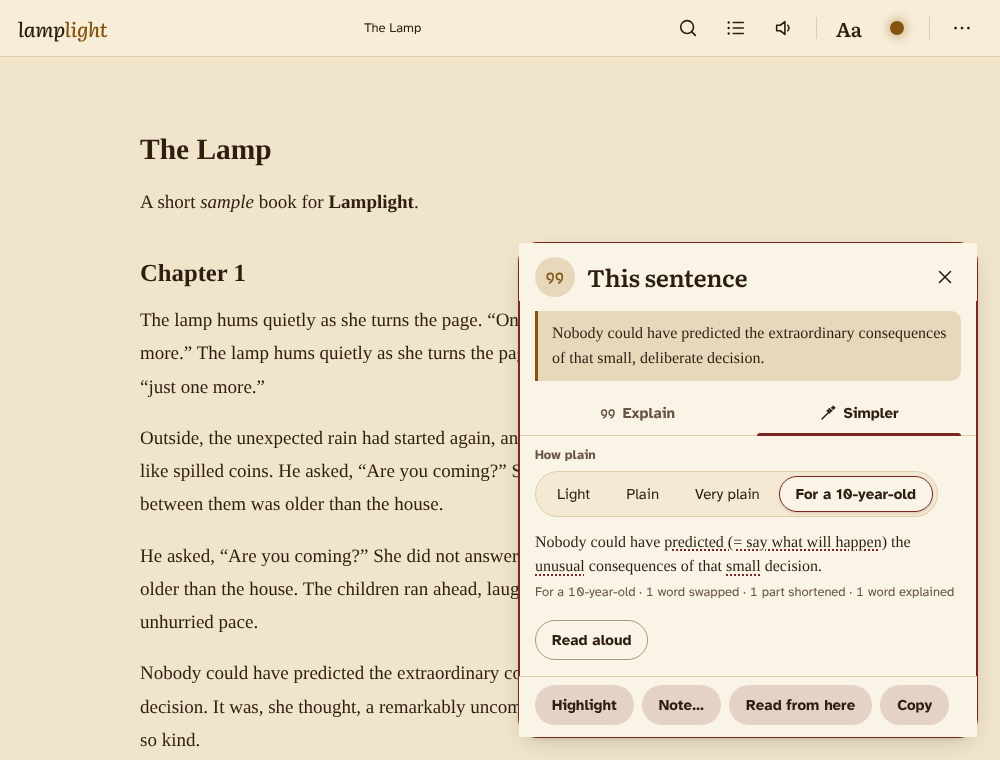
</p>
<p align="center">
  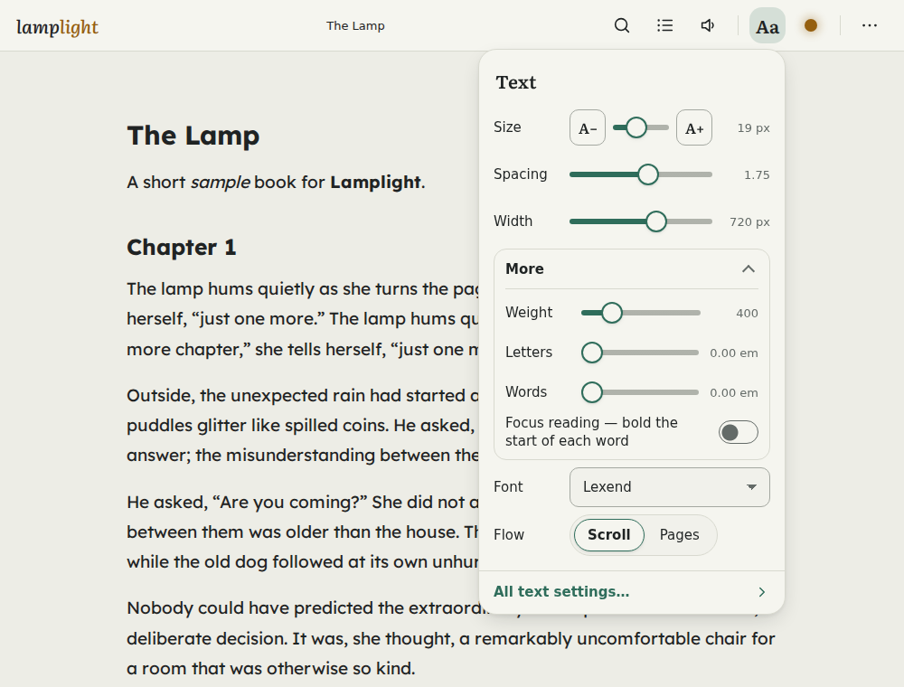
  &nbsp;&nbsp;
  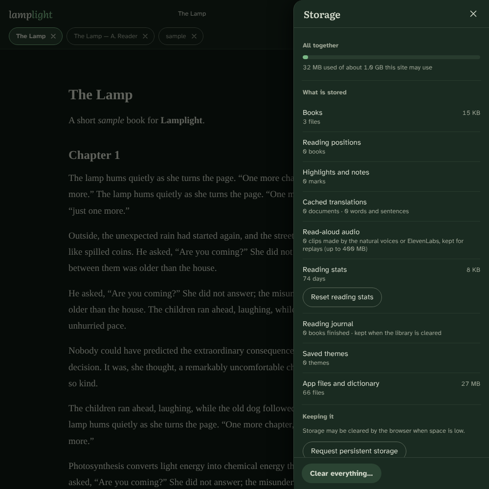
</p>

## Features

**Reading**
- A reader's shell that stays out of the way, in one plain interface typeface (Atkinson Hyperlegible, made for legibility) and sentence case throughout: a thin icon bar (search, contents, read aloud, **Aa** for type, the lamp for themes, the overflow menu), two popovers for the settings you change while reading, a tabbed settings sheet for the rest, one drawer for every panel, and a single bar at the foot holding the read-aloud player and the pager. On a phone every one of them — the popovers, the settings, the menu, the panels and the word card — is a **bottom sheet** with a handle that you can **swipe down to close**, and the Text sheet is made for a thumb: large A− and A+ buttons, line spacing and margins as three pictured choices each, and four fonts shown in their own face.
- **Made for one hand on a phone**: while a book is open the screen is the text, with no bar at the top. A slim strip at the foot holds the time left in the chapter and the **lamp**, a round button ringed with how far you are through the book; it slides away while you read on and comes back when you scroll up (in Pages flow, when you swipe down), and stays put while read aloud plays and in e-ink mode. Tap the lamp and the **dock** rises, in reach of the thumb: back to the library, the **book's title** with the chapter under it (tap it to switch between open books), Search, a slider to any page, a **Day / Night** switch, and Contents, Text, Read aloud, Theme and More, each named under its icon. A tap outside, a swipe down or Escape puts it away. Hold Read aloud for the voices. Books are named by **their own title** — an EPUB's metadata, the first heading of a Markdown, HTML or DOCX file, a DOCX's document title — in the bar, the tabs, the library, the *Up next* card and the journal, falling back to the file name without its extension.
- Opens **PDF, EPUB, DOCX, TXT, Markdown and HTML**. Saved web pages are reduced to clean reader text (menus, cookie banners, share bars and ads stripped).
- **Scroll** or **Pages** flow (tap the left or right edge, or swipe sideways, to turn); two pages side by side on wide screens, for PDFs too. In Pages flow a swipe down — or a tap on the top or bottom edge of the page — brings the bars back and a swipe up hides them; on a phone, which has no bars, a swipe up or a tap on blank space in the middle or at the foot of the page opens the dock. Tapping a word in the middle of the page always looks it up.
- **Twelve themes in six looks** — Day & Dusk, Paper & Ink, Sepia & Cocoa, Sage & Forest, Sea air & Canals, and Contrast — each a day theme and a night theme, every one checked for 4.5:1 text contrast. One tap on a look sets both, and the **Day / Night** switch at the head of the theme picker (and in the phone's dock), `t` or a hold on the lamp moves between them without changing the pair. **Day and night** follows the phone's dark mode from the first run (*Follow phone*; a device that asks for more contrast starts on the Contrast look), or keeps a night schedule, and a switch by hand while it is on lasts until its next change. Your own themes sit under *Mine*, and *Settings › Theme* can pair any day theme with any night theme.
- **Themes of your own**: *New theme* under *Mine* starts one from the colours on screen, with a live preview that keeps it readable; once saved, it takes the place of the theme on screen, as your day or your night theme. *Settings › Theme* edits the one on screen: colour pickers with hex fields for the background, text, accent and (under Advanced) the panel and secondary text, quick swatches and tint / brightness sliders, and a **live contrast meter** that rates every pairing AAA / AA / Low and can fix a failing colour in one tap. Keep **as many as you like** (rename, duplicate, save as new, delete). The installed app's title bar follows the theme.
- **Twenty-four fonts** in four groups — easy reading (**OpenDyslexic**, **Lexend**, **Atkinson Hyperlegible**, **Andika**), serif (Georgia, Palatino, Times, Literata, Source Serif, Lora, Merriweather, EB Garamond, Crimson Pro, Libre Baskerville, Bitter), sans (system, Helvetica / Arial, Verdana, Inter, IBM Plex Sans, Nunito) and mono (system, JetBrains Mono, IBM Plex Mono). Sixteen families are bundled as compact woff2 files and **loaded only when chosen**; the *Browse fonts…* panel shows each name in its own face. Text size, line spacing, column width, margins, justification and hyphenation; every size is in `rem`, so the phone's font-size setting scales the whole app.
- **Songs in the book**: a chapter that opens on its song — `♪ “To Build a Home” — The Cinematic Orchestra`, `Song “Eye of the Tiger” — Survivor`, `Now playing: …`, `Nu speelt: …` and the like, in an EPUB, DOCX, HTML, Markdown or TXT book — becomes a soft pill you can tap to **play it in Spotify** (the app, else the web player); hold it for YouTube Music, Apple Music or to copy the name. A player drawn after it (◁◁ II ▷▷, ━━━●────, 1:32 / 3:45) is left out, and ordinary dialogue (“Hello,” — said Anna) is not mistaken for a song. **Soundtrack** in the menu lists every song in book order with its chapter, a jump to it and *Copy list* for a playlist. Read aloud says “Song: Eye of the Tiger, by Survivor”. The text itself is never changed, so positions, highlights and notes stay put.
- **Focus reading**: the first letters of every word in bold (light, medium or strong: about a third, half or two thirds of each word), so the eye lands on each word sooner. It is added lazily around the page you are on and never changes the text itself, so positions, highlights, notes, search and read aloud work as before; code is left alone and printouts are plain.
- **Weight, letter spacing, word spacing and paragraph gap**: a weight slider from 300 to 800 for the families that ship a variable file (the rest offer their two weights and say so), with headings and bold kept a step ahead of the text. One link restores every typographic default.
- **Warmth**: a warm film that layers over any theme for evening reading, and **Warm at night**, which brings it on at night and clears it by morning: from 21:00 to 07:00, or the hours you set when Day and night is on a schedule, and with *Follow phone* also whenever the phone is set to dark. Its ceiling is computed per theme, so text still clears 4.5:1 at full strength: every built-in theme takes the whole film, and a theme of your own with less contrast to spare stops earlier.
- **Extra dim**: a black film over the whole screen — bars, panels and toasts included — from 0 to 85 %, for when the phone's lowest brightness is still too bright in bed; on its own or only during your night window. Every on / off setting is a **switch** with its caption under it, and the rows that depend on one (the dim level, *Only at night* and its hours) step back while it is off.
- **E-ink mode** for e-paper screens: pure black on white with no greys, tints, shadows, animation or smooth scrolling, highlights, notes, search hits and the sentence read aloud drawn as lines instead of fills, and whole-page turns in the Pages flow (tap the left third to go back, anywhere else to go on). Your own flow comes back when you turn it off, and a screen that reports a slow refresh is offered the mode once.
- PDF zoom, and "soften" for PDF pages in dark themes.
- **Zen mode** (`z`): only the text and the thin progress line, fullscreen where the browser allows it; Escape or `z` brings everything back. On a phone it is the text alone: scroll up (in Pages flow, swipe down or tap the middle) for the lamp, and tap it to leave.
- **Print**: a print stylesheet turns any text document into clean black-on-white pages (title line, link addresses, highlights kept as a grey wash); PDFs open in a new tab for the browser's own print.

**Understanding the text**
- **Tap a word** for its meaning from the built-in 170 000-entry dictionary (with an online fallback when a word is missing and you are online). Under the meaning, when you are online, **example sentences** from [Tatoeba](https://tatoeba.org) with the word highlighted and a translation under each (an English book: Dutch; a Dutch book: English): three at first, *More* for five more, a tap on one reads it aloud. A word seen before keeps its sentences offline; *Show example sentences (online)* in the Dictionary settings turns them off.
- **Word parts** under every definition: the word broken into **prefix, root and suffix** with the meaning and origin of each part and a plain "so: not able to be broken" reading — from tables of 111 prefixes, 97 suffixes and endings and 357 Latin, Greek and Old English roots (`morph.js`, loaded on demand). Tapping a base looks it up in turn.
- **Hold a sentence** (right-click on desktop, or select text) for an offline **Explain** card: the sentence split into clauses, who / did what / to whom, where and when, the tense with a one-line meaning, phrasal verbs and idioms found in the dictionary, and the sentence rewritten in plainer words. Key words are glossed underneath.
- **About this text** (`i`): word, unique-word and sentence counts, reading time at your own speed, **reading level** (Flesch reading ease with a plain-English band, Flesch–Kincaid grade and age, Coleman–Liau as a second opinion), vocabulary richness, dialogue share, and the **thirty hardest words** in the document — tap one for its definition or find it in the text. Works for PDFs too.
- **Simplify** any selected sentence or passage (the pill's *Simplify* button, or from the Explain card): an offline, rule-based rewrite that swaps rarer words for common ones, replaces idioms and wordy phrases, splits over-long sentences and turns clear passives into actives, with every change underlined and explained ("was 'extraordinary' — rarer word") so nothing is hidden; copy it or hear it read aloud.
  **Four strengths**: *light* swaps only genuinely rare words; *plain* is the default; *very plain* also splits long sentences, breaks semicolons and dashes into full stops and rewrites stiff connectors; *for a ten-year-old* adds all of that plus cutting trailing clauses loose, reducing stacked adjectives, writing out abbreviations, saying large numbers in words and glossing any word still likely to be unfamiliar.
- **Figures of speech and register** in the Explain card: similes, metaphors, personification, hyperbole and idioms are named and quoted — touch one and the exact words light up in the sentence — and the sentence's register (archaic, spoken, formal, literary or neutral) is given with the evidence for it.
- **Translate** a tapped word, a selected sentence, or the **whole book**. A tapped word or a selected sentence shows its translation at once in the card — under the word, or under the sentence — whenever the book is in another language than yours: your device's language (*Automatic* under Translation in the settings), or a language you choose there. An English book gives a Dutch reader Dutch translations; a book already in your own language shows none (and *Translate book* turns a Dutch book into English, an English one into Dutch).
  **Dutch ↔ English pack**: [Firefox Translations](https://github.com/mozilla/translations) (Bergamot) with Mozilla's Dutch–English models, downloaded once (about 50 MB, *Translation* in the settings, or offered in the card the first time) and then run on the device, offline: a tapped word in a few hundredths of a second, a sentence in about a tenth, a whole book of 90 000 words in roughly 15–25 minutes on a phone. For Dutch and English it is preferred over every other engine once it is there. Other languages (36 in all) use the browser's **built-in on-device translator** where there is one (Chrome and Edge on desktop), and the free **MyMemory** web service for words and sentences.
  **Translate book** (menu) works with the pack or the built-in translator: paragraph by paragraph in the background, from where you are reading outward, with a progress line and the time left. It rests while Lamplight is hidden, carries on where it left off when you come back or reopen the book, and the book then opens translated, even offline. Read it as **Translation only** — the translation in place of the original; tap or hold a paragraph to see its original — or **Both**, the translation under each paragraph. The original text itself is never changed, so highlights, notes, search, positions and read aloud keep working in either view (read aloud reads the original).

**Keeping your place**
- **Previously…**: open a book (or come back to its tab) two hours or more after you last read it and a card over the text says how long you were away ("3 hours ago", "yesterday", "5 days ago"), gives three to five key sentences from what you read last time — picked on the device from the words that recur, the characters in them and where they fall, in reading order — and names the characters who appeared; *Read it aloud* speaks it with your read-aloud voice, *Continue* puts it away, and the menu's *Previously…* brings it back at any time. Text documents and PDFs with text.
- **Library**: every file you open is kept on the device with its progress; reopen and you are exactly where you left off — across font, width and flow changes. **Pin** the books you are reading to keep them at the top in an order you set, and the Continue card follows the pin. Each book is a card with its title in the serif of the headings; *Reading journal* sits at the head of the list and *Clear library…* apart at its foot, where it asks first.
- A **finish forecast** on every book, as time left and as roughly how many more evenings at your usual reading rhythm.
- A **Storage panel** showing exactly what Lamplight keeps on this device — books, positions, highlights, cached translations, the read-aloud audio, stats, the reading journal, saved themes, the natural voices and their engine, the Dutch ↔ English pack, the app files and dictionary — against your browser's quota, with each row clearable on its own (*Clear everything* takes all of it, settings and an ElevenLabs key included; only the app itself stays, so it still opens offline).
- Changes you might regret can be **undone from the toast** for a few seconds: *Bookmark here*, removing a highlight or a note, and removing a book from the library.
- **Highlights, bookmarks and notes**, exportable as Markdown, JSON or **Obsidian** Markdown (front matter, a legend callout and a heading per chapter). Type `#tags` in a note and they become filter chips; name the four highlight colours once and the names appear everywhere you pick one; search across every highlight, note and bookmark.
- **Tabs** for several open documents, named by their titles (Ctrl/⌘+Tab switches; × closes); on a phone the tabs fold into the title in the bar.
- **Contents** panel: PDF outline, EPUB navigation or document headings. **Search** inside the document, PDFs included.
- A **reading journal** (`j`): read to the end of a book after reading it for a while and, once the last page has had time to be read (or you turn on past it), a small *Finished* card asks for 1–5 stars, a line of your own and the day you finished (*Mark as finished* in the menu opens it anywhere; a re-read is a new entry). The journal lists your books newest first, a group per year, each with its stars, note and how long it took; tap one to edit it, open the book or delete it, and export the lot as Markdown. Finished books show a check and their stars in the library, the yearly books goal counts the journal, and clearing the library keeps it.
- **Reading stats and streaks** (`g`): minutes, words and pages per day, a daily goal you choose, the current and longest **streak** of days you kept it, four weeks of bars, a **twelve-week speed trend** with a plain reading of it, **yearly book and page goals** alongside the daily one, a per-book section with time read and its forecast, and all-time totals. The start screen shows your streak; everything can be exported as JSON or reset.
- A **reading-pace detector** behind all of it. Scrolling quickly to check something, hopping between search hits, page-flipping, auto-scroll, read aloud, a lookup card left open and simply walking away are all told apart from reading, and only genuine reading is timed. Words skimmed past are counted separately from words read. The pace is kept per book as well as overall, with a confidence that says how much reading it rests on, and it drives the time-left readout, the forecasts and auto-scroll's speed.

**Reading aids**
- **Read aloud** (Web Speech API) sentence by sentence, with a picker that leads on a handful of good choices rather than a hundred: a **recommended pair** of narrator and dialogue voice with a preview on each, six cards for the best women's and men's voices in the document's language, and the full list folded away behind one tap. Gender is read from the voice's identifier as well as its name, so the men's voices on Android and the Microsoft Natural set are recognised; where a device says nothing, a chip on each card lets you mark it and Lamplight remembers. Voices you never want can be hidden. Your choices are kept **per language**, so an English book and a Spanish one keep their own. There is a **separate voice for dialogue** (by default the other voice, so quoted speech is easy to tell from narration; dialogue written with dashes, as many Dutch, French and Russian books do, counts as speech too) and **expression read off the text**: questions lift, exclamations quicken, ellipses and paragraph ends pause, headings slow down, and "whispered" / "shouted" / "sighed" around a quote change how it is spoken. Off, Natural or Dramatic. The document's language is detected and used for the voice and for hyphenation, and playback eases in over the first three sentences. **Lock-screen and headphone controls** (play, pause, previous and next sentence) through the Media Session API, and a **sleep timer** that stops at the end of the sentence after 15 to 60 minutes or at the end of the chapter. The player is **one row**: the voice (the sleep timer a small badge on it), ‹ ▶ › with the big play button in the middle, a speed chip that opens the slider and 0.8 / 1 / 1.25 / 1.5× presets, and ×; in Pages flow the page and the time left fold into a thin line above it.
- **A voice per character**: read aloud gives every speaking character their own device voice (turn off in settings). Who speaks each line is worked out on the device from the quoted lines and the speech tags around them (*said Anna*, *he whispered*, *cried his wife*), who acts beside a line (*Anna frowned.*), the names addressed in it (*Tom, wait!* is not Tom's line) and who takes turns in the conversation; pronouns go to the latest character of that gender, and gender comes from titles, a list of common first names and the text. *Voices for characters…* shows who was found and lets you change each voice and its pitch. Speakers with no name (*he*, *she*, *the stranger*) get voices of their own too, and no quoted line is read in the narrator's voice unless the narrator says it (*I said*).
- **Who’s who** (in the menu, and from *Voices for characters…*): the characters found in the open book, with their gender, how many lines they speak, how often they are mentioned and where they first appear; open one for their lines, each a jump into the text, and *First appearance*. When read aloud gives characters voices, each one's voice can be changed there too. For a PDF it covers the pages loaded so far.
- **Read aloud with ElevenLabs voices** (optional): paste your own ElevenLabs API key and the book is narrated by a narrator voice plus a different voice for each speaking character, worked out offline from the text. Audio is generated as you listen and kept on the device, so replays are free. Limitations: speaker attribution understands English speech tags; dialogue introduced with an em-dash is read by the narrator.
- **Natural voices** (optional, free): a one-time download from huggingface.co puts a speech model on the device, and from then on the book is read **offline** by natural-sounding voices — a narrator of your choice and a **different voice for each speaking character**, cast the same way as with ElevenLabs. Two qualities: **Fast** (the default, [Piper](https://github.com/rhasspy/piper) with the LibriTTS-R voice, ≈ 80 MB, 24 voices, plus **Dutch voices** for Dutch books: the Multilingual LibriSpeech voice nl_NL-mls-medium, ≈ 77 MB, 23 voices, downloaded and removed on its own from the Voices panel while a Dutch book is open) makes speech about eleven times quicker than Best, fast enough to stay ahead of the reading on most phones, so it plays without pauses; **Best** (Kokoro-82M, ≈ 105 MB, 28 American and British voices) sounds a little more natural but is slower than reading on most phones, so *Prepare book* makes the whole book ahead first. Speech is made as you listen, ahead of the reading position, and kept on the device (up to 400 MB across all books, oldest first), so replays are instant. Limitations: Fast speaks **English and Dutch**, Best **English** only (a book in another language is read by the device voice instead); each model takes a few seconds to load each time reading starts.
- Reading **ruler**, **auto-scroll** at your pace (timed page turns in Pages flow), and a progress readout with **time left** from your measured reading speed.
- **Speed reading** (`w`): one word at a time from where you are, each centred on its recognition point (that letter in the accent colour, under a small guide mark), at 150 to 900 words a minute; a little longer after commas, sentences, paragraphs and long words. Space or a tap plays and pauses, the arrows go back or on a sentence and change the speed, and Esc (or Back on a phone) closes it — the book then carries on from the word it stopped at, which is also kept if you leave the app with it open. Long compounds come in two or three parts.
- **Background sounds**: rain, fire, a café, a forest at night and waves, made on the device as they play (no recordings, nothing to download). One switch turns them on or off; tap a sound's tile to start it or to add it to what is playing (again to take it out), with the blend of all five under *Mix* and a master volume. The menu's entry plays your last mix in one tap, and reads *Stop background sounds* while they play; *Sound mix…* beside it opens the panel. They play while a book is open, under read aloud too, fade in and out, pause when you leave the page, and are remembered.
- The **More** sheet on a phone opens on two large tiles, Bookmark here and Previously… (the dock already has Read aloud, Contents, Search and the way back to the library), then Reading, Tools and Lamplight, with Settings as the gear in its head.
- Screen wake lock while reading; keyboard shortcuts (`?` shows them all); works with reduced-motion and forced-colour settings.

**As an app**
- **In Dutch or in English**: the whole interface — menus, panels, settings, messages, keyboard help, units, dates and relative times ("3 uur geleden") — is in natural Dutch on a device set to Dutch and in English everywhere else. *Settings › Reading › App language* (Automatisch / Nederlands / English) overrides the device; switching reloads Lamplight at the same place in the book. The book's text, file names, dictionary definitions and voice names are never translated.
- Installs as a PWA, works fully offline (a versioned service worker precaches everything — fonts and word-part tables included — and offers a one-tap reload when a new version is ready).
- "Open with" from the file manager, share files or text to Lamplight from other apps, app shortcuts (Continue reading, Library).

## Install / use

You can use Lamplight in the browser at the live link, or install it:

- **Android / Chrome:** open the link → menu ⋮ → *Install app* (or *Add to Home screen*).
- **iPhone / iPad:** open the link in Safari → Share → *Add to Home Screen*.
- **Desktop (Chrome, Edge):** click the install icon in the address bar.

After the first visit everything is cached; the app, the dictionary, the fonts and the read-aloud voices your device provides work with no connection at all.

### Self-hosting

Lamplight is plain static files. Copy the repository to any static host (GitHub Pages, Netlify, a folder on a web server) — it must be served over **HTTPS** (or `localhost`) for the service worker and installation to work. There is nothing to build:

```
index.html              the shell
i18n.js                 the interface's language: English (the source) and the Dutch table, with its glossary
app.js  app.css         the reader
explain.js              the offline sentence explainer
morph.js                word parts: prefixes, roots and suffixes with meanings
translate.js            translation engines, the bilingual page view and its cache
audiobook.js            who speaks each line, a voice per character, ElevenLabs and natural (Piper, Kokoro) narration (loaded on demand)
sw.js                   service worker (bump VERSION on every release)
manifest.webmanifest    PWA manifest
dict1–6.json, dict-index.json   the offline dictionary (alphabetical chunks + index)
vendor/                 pdf.js, mammoth, marked, DOMPurify, JSZip
vendor/kokoro/          kokoro-js and ONNX Runtime's WebAssembly for the natural voices (the models are downloaded from huggingface.co on demand)
vendor/piper/           ONNX Runtime Web's JavaScript and the espeak-ng phonemizer for the Fast natural voices (Piper)
vendor/bergamot/        the Firefox Translations (Bergamot) runtime for the Dutch ↔ English pack (downloaded on demand, not precached)
models/bergamot/        Mozilla's Dutch → English and English → Dutch translation models and their vocabulary, gzipped (downloaded on demand)
workers/                the DOCX worker, the natural-voices workers (Piper, Kokoro) and the translation worker (mt-worker.js, the pack)
fonts/                  the bundled reading fonts (Latin woff2 subsets) and their licences
tests/                  browser tests (not needed to run the app)
```

Opening `index.html` straight from a folder (`file://`) works for reading, but browsers block `fetch()` on `file://` URLs, so the offline dictionary, the bundled fonts (and the service worker) are only available when the folder is served over HTTP(S).

### Read aloud with ElevenLabs (optional)

Start reading aloud (`r`, or *Read aloud* in the menu), press the voice button in the bar to open *Read-aloud voices*, and under *Voices from* choose *ElevenLabs*; then *ElevenLabs API key…* and paste a key from your ElevenLabs account. Pick a narrator voice and a model; *Voices for characters…* shows who was found speaking in the open book and lets you change each voice. The key is stored only in your browser's local storage and is sent only to `api.elevenlabs.io` while reading aloud with that engine; every clip is kept in IndexedDB, so a sentence is only ever paid for once. The bar shows roughly how many characters have been sent.

### Natural voices (optional)

Under *Voices from* choose *Natural voices*, pick a *Quality*, then *Download natural voices* (once; a progress bar shows the download — starting to read aloud with the engine downloads it too when you are online, and reads with the device voice when you are not). Pick a narrator; *Voices for characters…* shows who was found speaking in the open book and lets you change each voice.

In Chrome (Android and desktop) the natural voices and the Dutch ↔ English pack download through Background Fetch (`bgfetch.js`, stored by `sw.js`): the browser shows its own download notification and carries on when Lamplight is closed; elsewhere they download in the page, so keep Lamplight open until it finishes.

- **Fast · keeps up on phones** (the default, ≈ 80 MB): [Piper](https://github.com/rhasspy/piper) with the voice [en_US-libritts_r-medium](https://huggingface.co/rhasspy/piper-voices/tree/main/en/en_US/libritts_r/medium), one model trained on 904 LibriTTS-R speakers, of which Lamplight offers 24 (12 women's and 12 men's voices, picked by measuring pitch, loudness and pace). The text is turned into phonemes by espeak-ng and the model runs in ONNX Runtime, both in a Web Worker; it makes speech about eleven times quicker than Kokoro, so on most phones it stays ahead of the reading and there are no pauses. The model and its settings are kept in Cache Storage (`piper-voices`).
- **Best · slower, prepare first** (≈ 105 MB): [Kokoro-82M](https://huggingface.co/hexgrad/Kokoro-82M) through kokoro-js and ONNX Runtime in a Web Worker, 28 American and British voices (half a megabyte each, all fetched right after the model so every character works offline). On a phone it makes speech slower than it is read, so it pauses every few sentences unless the book is made ahead: *Prepare book* does that (keep Lamplight open while it works; it carries on where it left off), and reading that starts early waits, counting down, just long enough not to catch up.

Readers who used natural voices before the quality choice existed are moved to *Fast* once; *Best* is a tap away. Besides its model, either quality needs the speech engine it runs on (ONNX Runtime, shared by the two, with Piper's phonemizer or kokoro-js: about 23 MB), fetched from this site the first time and kept across updates. Either way, nothing is sent anywhere and it works offline once the model is on the device; the bar shows *Preparing…* while the model loads and *Generating…* while a sentence is being made. Every clip is kept in IndexedDB — up to 400 MB across all books; *Audio kept on this device* in the voices panel shows how much, with a *Clear* — and *Remove* takes the chosen quality's model off the device again. The service worker adds cross-origin isolation headers to the page so the models can use several threads where the browser allows it.

## Keyboard shortcuts

`o` open · `s` settings · `t` day / night theme · `+` / `−` text size or zoom · `p` scroll / pages · `/` or Ctrl+F search · `c` contents · `b` bookmark here · `n` bookmarks & notes · `r` read aloud · `l` reading ruler · `a` auto-scroll · `w` speed reading (then Space play / pause, ← → a sentence, ↑ ↓ speed, Esc close) · `z` zen mode · `i` about this text · `g` reading stats · `h` library · `?` this list · arrows / PgUp / PgDn / Space turn pages, Home / End first / last page · Esc closes anything.

## Privacy

Files, positions, highlights, notes, the reading journal, cached translations, cached read-aloud audio and the voices cast for each book's characters live in your browser's IndexedDB; settings, saved themes, reading stats and the reading sessions behind *Previously…* (and, if you use those engines, your ElevenLabs key, narrator, model and voice list, and the natural voices' quality and narrators) in local storage. Nothing is uploaded anywhere unless you turn on the ElevenLabs read-aloud engine, which sends the sentences being read (and your key) to `api.elevenlabs.io` and nothing else. The natural voices are downloaded once from `huggingface.co` — Fast: the Piper model and its settings file, about 78 MB; Best: the Kokoro model and its 28 voice files, about 105 MB — kept in the browser's Cache Storage, and then run entirely on the device: nothing is uploaded, and no text or audio leaves it. The Dutch ↔ English translation pack (the Bergamot runtime and Mozilla's two models, about 50 MB) is downloaded once, when you ask for it, from the same site that serves Lamplight (the files are in this repository, under `vendor/bergamot/` and `models/bergamot/`), kept in the browser's Cache Storage (`bergamot-models`), and then runs entirely on the device: nothing you read or translate is uploaded. Apart from that, the only network requests the app makes are for its own files (cached after the first visit), the free `api.dictionaryapi.dev` lookup when a word is not in the offline dictionary and you are online, the example sentences under a word's meaning (when you are online and *Show example sentences (online)* is on, the tapped word — and its base form — is sent to Tatoeba, `api.tatoeba.org`; the answers are kept in the browser's Cache Storage, `tatoeba-examples`), and MyMemory (`api.mymemory.translated.net`), which receives the word or sentence you tap in a book in another language when neither the Dutch ↔ English pack nor the browser's built-in translator can translate it. The built-in translator runs on your device, and so does working out who speaks each line. Read aloud with the device voice uses the speech voices installed on your device; some browsers list "online" voices that the browser itself fetches.

## Development

Everything is hand-written ES5-style JavaScript in `app.js` (with `explain.js`, `morph.js`, `translate.js`, `audiobook.js` and `sounds.js` loaded on demand); there is no bundler and no dependencies to install. To work on it, serve the folder over HTTPS or `localhost` (for example `python3 -m http.server`) and open it in a browser.

Releasing: bump `VERSION` in `sw.js` — every file, `index.html` included, is served from that version's cache, so the shell and its scripts always match; installed copies pick the new version up in the background: on the library screen it takes over at once, and while a book is open a *Reload* toast offers it. The ⋯ menu's Storage panel shows the version in use. Without the bump, a deployed change is not picked up by installed copies. The dictionary chunks and the fonts (about 22 MB) are not downloaded again with each release: the new version asks the server whether the copies the old one kept have changed (`If-None-Match`), and keeps them when they have not. The natural voices' runtime (`vendor/kokoro/`, 24 MB, and `vendor/piper/`, 1.7 MB) is not precached: it is cached the first time an engine that needs it runs, in its own cache (`natural-runtime-1` in `sw.js`, `RUNTIME`), which survives releases like the model caches (`piper-voices`, `transformers-cache`, `kokoro-voices`), so voices on the device keep working offline after an update. Those files keep their names, so when one of them changes, bump the number in `RUNTIME` too. The Dutch ↔ English pack (`vendor/bergamot/`, `models/bergamot/`, 50 MB) is neither precached nor copied into the version's cache: `workers/mt-worker.js` keeps it in its own cache, `bergamot-models`, which also survives releases. The deploy workflow also runs Lighthouse against the published site and requires an accessibility score of at least 0.9.

### Tests

`tests/` holds browser tests that drive the real app in headless Chromium through [Playwright](https://playwright.dev) (the only development dependency; install it globally with `npm i -g playwright` and `npx playwright install chromium`, or point `PLAYWRIGHT_BROWSERS_PATH` at an existing install):

```
python3 tests/make-fixtures.py        # builds sample.txt/.md/.html/.epub/.docx/.pdf in tests/fixtures
NODE_PATH=$(npm root -g) node tests/all.js          # every suite in turn, with one summary table
NODE_PATH=$(npm root -g) node tests/all.js '^ui-'   # or a subset, by pattern
NODE_PATH=$(npm root -g) node tests/smoke.js        # every format, both flows, a dictionary tap
NODE_PATH=$(npm root -g) node tests/regression.js   # library, tabs, marks, search, contents, explain, PDF, offline, update toast, install
NODE_PATH=$(npm root -g) node tests/themes.js       # the twelve themes: contrast audit, the six looks, no near-duplicates, where retired ones go (node only)
NODE_PATH=$(npm root -g) node tests/wordparts.js    # 300 word decompositions (node only)
```

plus `themes-browser.js`, `fonts.js`, `type2.js`, `speak.js` (with a stubbed speech engine and media session), `wordparts-browser.js`, `about.js`, `stats.js` and `stats2.js` (with Playwright's fake clock), `library2.js`, `notes2.js`, `journal.js` (the reading journal and its *Finished* card, against a fake clock), `reading.js` (speed reading and focus reading), `zen.js`, `print.js` (print media emulation), `translate.js` (stubbed translator and MyMemory routes, and the real Dutch ↔ English pack), `simplify.js`, `explain2.js`, `pace.js` (a simulated reader driven against a fake clock), `i18n.js` (the Dutch interface: the table, the main screens with no English left, switching the language at the same place), `ui-a/b/c.js` for the interface itself, `qol.js` for a phone in one hand (the dock's tools, long presses, swiping sheets down, opening the dock in Pages flow, Undo, one-tap sounds and themes), `phonedock.js` for the phone reading screen (the strip, the lamp and its ring, the dock, its gestures, read aloud, zen, the modes and the narrowest widths), `textsheet.js` for the phone Text sheet, `daynight.js` for the Day/Night switch and its hold while Day and night is on, `looks.js` for the theme picker (the six looks, the Day/Night switch, themes of your own, a first run, readers of a retired theme moving to a kept one, and the one-time offer of their old colours) and `look.js` for the interface typeface and sentence case. Each script starts its own server on a free port and exits non-zero on failure.

`tests/screenshots.js` remakes the pictures at the top of this file from the running app, so they never drift from it (`node tests/screenshots.js` for all of them, or name the ones you want). It writes into `docs/screenshots/`, so `tests/all.js` leaves it out: run it on its own when the pictures should change.

The reading-pace detector in `app.js` turns the visible text window into a stream of samples, coalesces them into gestures, classifies each transition (still, step, skim, pause, back, jump, navigation) and collects the ones that are reading into runs; the estimate is a weighted median over recent runs with a prior that fades as real reading arrives. Anything that is not reading — a panel or card over the text, read aloud, auto-scroll, a hidden tab, a search or contents jump — is subtracted as a blocked interval rather than guessed at. `window.llPace` exposes its state for the tests.

The `explain.js` analyser is rule-based: a tokeniser that splits contractions, a part-of-speech tagger that combines the dictionary with built-in word lists, clause splitting on conjunctions, subordinators and relative pronouns, and a small grammar for verb groups (tense, aspect, modals, passives, questions and imperatives). It runs in well under a millisecond per sentence. `morph.js` works the same way: tables of affixes and bound roots, spelling repairs (a dropped *e*, a doubled consonant, *y* to *i*), and a scorer that prefers readings whose parts are all known and leaves common words alone.

## Credits

Lamplight bundles these open-source projects; each keeps its own licence (in `vendor/` and `fonts/`):

- [pdf.js](https://mozilla.github.io/pdf.js/) 3.11.174 — Mozilla, Apache-2.0 — renders PDFs.
- [mammoth.js](https://github.com/mwilliamson/mammoth.js) 1.6.0 — Michael Williamson, BSD-2-Clause — converts DOCX to HTML.
- [marked](https://marked.js.org/) 9.1.6 — MIT — renders Markdown.
- [DOMPurify](https://github.com/cure53/DOMPurify) 3.0.8 — Cure53, Apache-2.0 / MPL-2.0 — sanitises every document before it is shown.
- [JSZip](https://stuk.github.io/jszip/) 3.10.1 — Stuart Knightley, MIT — unpacks EPUB files.
- Fonts, all under the SIL Open Font License 1.1, each with its copyright holders, reserved font name and upstream project listed in `fonts/LICENSES.md`: [Atkinson Hyperlegible](https://brailleinstitute.org/freefont) (Braille Institute of America), [OpenDyslexic](https://opendyslexic.org/) (Abbie Gonzalez), [Lexend](https://github.com/googlefonts/lexend), [Andika](https://software.sil.org/andika/) (SIL International), [Literata](https://github.com/googlefonts/literata), [Source Serif](https://github.com/adobe-fonts/source-serif) (Adobe), [Lora](https://github.com/cyrealtype/Lora-Cyrillic), [Merriweather](https://github.com/EbenSorkin/Merriweather4), [EB Garamond](https://github.com/octaviopardo/EBGaramond12), [Crimson Pro](https://github.com/Fonthausen/CrimsonPro), [Libre Baskerville](https://github.com/impallari/Libre-Baskerville), [Bitter](https://github.com/solmatas/BitterPro), [Inter](https://github.com/rsms/inter), [IBM Plex Sans and Mono](https://github.com/IBM/plex) (IBM), [Nunito](https://github.com/googlefonts/nunito) and [JetBrains Mono](https://github.com/JetBrains/JetBrainsMono) (JetBrains). The Latin woff2 subsets are the ones published by [Fontsource](https://fontsource.org/).
- The offline dictionary (`dict1–6.json`) combines public-domain definitions from *Webster's Revised Unabridged Dictionary* (1913) with WordNet-style glosses, synonyms and IPA pronunciations. [WordNet](https://wordnet.princeton.edu/) is © Princeton University, used under the WordNet License.
- The word-frequency list inside `explain.js` (used to decide which words need glossing, and by *About this text* to find the hardest words) is derived from [google-10000-english](https://github.com/first20hours/google-10000-english), MIT.
- The affix and root tables in `morph.js` were written for Lamplight from the classic school lists of Latin and Greek word roots.
- The optional online word lookup uses the [Free Dictionary API](https://dictionaryapi.dev/).
- The example sentences and their translations come from [Tatoeba](https://tatoeba.org) (CC BY 2.0 FR); each one links to its page there, which names its author.
- The optional multi-voice narration uses the [ElevenLabs](https://elevenlabs.io/) text-to-speech API with your own key.
- The Fast natural voices are the [Piper](https://github.com/rhasspy/piper) voice [en_US-libritts_r-medium](https://huggingface.co/rhasspy/piper-voices/tree/main/en/en_US/libritts_r/medium) from [rhasspy/piper-voices](https://huggingface.co/rhasspy/piper-voices) (MIT; trained on the [LibriTTS-R](http://www.openslr.org/141/) corpus, CC BY 4.0, fine-tuned from Piper's en_US lessac voice; downloaded on demand), with phonemes from [phonemizer.js](https://github.com/xenova/phonemizer.js) 1.2.1 (Xenova, Apache-2.0), which includes [eSpeak NG](https://github.com/espeak-ng/espeak-ng) (GPL-3.0-or-later).
- The Best natural voices are [Kokoro-82M](https://huggingface.co/hexgrad/Kokoro-82M) by hexgrad, Apache-2.0 (the ONNX build [onnx-community/Kokoro-82M-v1.0-ONNX](https://huggingface.co/onnx-community/Kokoro-82M-v1.0-ONNX), downloaded on demand), run on the device by [kokoro-js](https://github.com/hexgrad/kokoro) 1.2.1 (Apache-2.0, bundling [Transformers.js](https://github.com/huggingface/transformers.js)).
- Both run in [ONNX Runtime](https://onnxruntime.ai/) Web 1.22 (Microsoft, MIT); see `vendor/LICENSES.md`. eSpeak NG's licence, the GPL-3.0, is in `vendor/piper/ESPEAK-NG-LICENSE`.
- The Dutch ↔ English pack is [bergamot-translator](https://github.com/browsermt/bergamot-translator) 0.4.9, the translation engine of [Firefox Translations](https://github.com/mozilla/translations) (MPL-2.0), with Mozilla's Dutch → English and English → Dutch models ([mozilla/firefox-translations-models](https://github.com/mozilla/firefox-translations-models), MPL-2.0); the licence text is `vendor/bergamot/LICENSE`, and where the models come from is in `vendor/LICENSES.md`.

Lamplight itself is released under the [MIT License](LICENSE).
